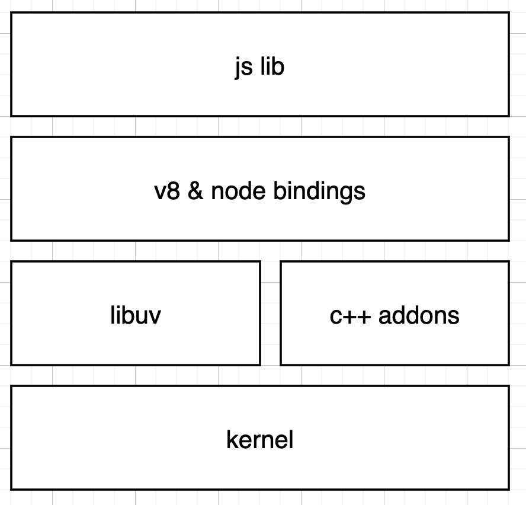

# node基本架构

Nodejs源码js部分整体来说比较简单易读。通读完核心模块之后能够对nodejs有更好的认识。下面是nodejs的架构图：

nodejs由五个部分组成：

- js lib
	- js标准库，对外提供js接口
- v8
	- js引擎，js的编译器和解释器
- node bindings
	- 提供桥接c++层的能力，包括与libuv、c-cares、llhttp等模块的连接
- libuv
	- 一个事件驱动的异步非阻塞io库
	- 提供跨平台能力
	- 通过系统调用，提供与操作系统内核的交互能力，提供fs、process、thread、socket、epoll等能力
- c++ addonss
	- 如c-cares、llhttp

libuv是nodejs的灵魂。所以，我一定会~~(flag)~~努力学习linux & c++，争取给大家带来更准确、深入的nodejs源码解析。

