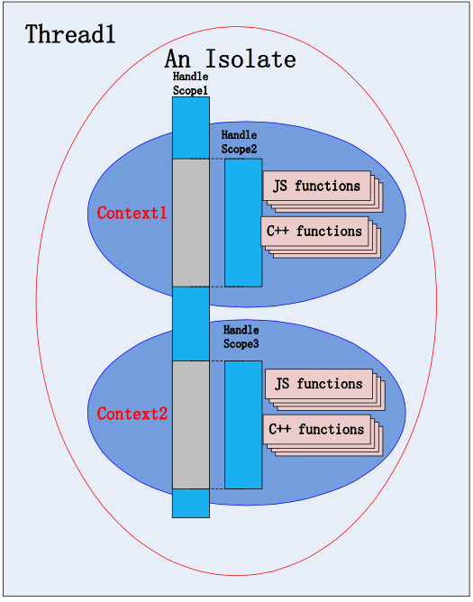

# v8的一些概念



## namespace v8

在`v8.h`中声明了`namespace v8`，其中包含：

```C++
namespace v8 {
  class Context;
  class Isolate;
  // handle是local的一个别名
  class Local;
  friend class HandleScope;
}
```


## isolate

在`v8.h`中，我们可以看到`Isolate`类：

```C++
/**
 * Isolate represents an isolated instance of the V8 engine.  V8 isolates have
 * completely separate states.  Objects from one isolate must not be used in
 * other isolates.  The embedder can create multiple isolates and use them in
 * parallel in multiple threads.  An isolate can be entered by at most one
 * thread at any given time.  The Locker/Unlocker API must be used to
 * synchronize.
 */
class V8_EXPORT Isolate {
  // ...
}
```


isolate实际上是一个v8引擎的实例。它有自己独立的堆栈。对象不能在不同的isolate之间共享。嵌入v8的程序（如浏览器）可以创建多个isolate，每个isolate同一时间只能被一个线程使用。

## context

context类定义如下：

```C++
/**
 * A sandboxed execution context with its own set of built-in objects
 * and functions.
 */
class V8_EXPORT Context : public Data {
 // ...
}
```


简单说context是js运行的沙箱环境。这个环境能够提供c++模块供js代码调用。js函数调用以它最近的context为准。

## handle

在`v8.h`中定义了handle：

```C++

/**
 * An object reference managed by the v8 garbage collector.
 *
 * All objects returned from v8 have to be tracked by the garbage
 * collector so that it knows that the objects are still alive.  Also,
 * because the garbage collector may move objects, it is unsafe to
 * point directly to an object.  Instead, all objects are stored in
 * handles which are known by the garbage collector and updated
 * whenever an object moves.  Handles should always be passed by value
 * (except in cases like out-parameters) and they should never be
 * allocated on the heap.
 *
 * There are two types of handles: local and persistent handles.
 *
 * Local handles are light-weight and transient and typically used in
 * local operations.  They are managed by HandleScopes. That means that a
 * HandleScope must exist on the stack when they are created and that they are
 * only valid inside of the HandleScope active during their creation.
 * For passing a local handle to an outer HandleScope, an EscapableHandleScope
 * and its Escape() method must be used.
 *
 * Persistent handles can be used when storing objects across several
 * independent operations and have to be explicitly deallocated when they're no
 * longer used.
 *
 * It is safe to extract the object stored in the handle by
 * dereferencing the handle (for instance, to extract the Object* from
 * a Local<Object>); the value will still be governed by a handle
 * behind the scenes and the same rules apply to these values as to
 * their handles.
 */
template <class T>
class Local {
 // ...
}

#if !defined(V8_IMMINENT_DEPRECATION_WARNINGS)
template <class T>
// handle是Local的别名
using Handle = Local<T>;
#endif

```


v8的内存分配是在堆中分配的。c++和js的对象都是。为了对这些对象进行内存管理，v8的垃圾回收器通过handle的scope来管理这些对象。handle就是这些对象的引用集合。

当使用或者分配这些对象的时候，必须通过scope进行操作。这样垃圾回收器通过访问handle，就能够了解对象处于什么状态了。

handle分为两种，一种是`localHandle`，另一种是`persistentHandle`。

`localHandle`通过`handleScope`进行管理，而`persistentHandle`则超出了`handleScope`的管理范围，需要手动释放。

## handleScope

```C++
/**
 * A stack-allocated class that governs a number of local handles.
 * After a handle scope has been created, all local handles will be
 * allocated within that handle scope until either the handle scope is
 * deleted or another handle scope is created.  If there is already a
 * handle scope and a new one is created, all allocations will take
 * place in the new handle scope until it is deleted.  After that,
 * new handles will again be allocated in the original handle scope.
 *
 * After the handle scope of a local handle has been deleted the
 * garbage collector will no longer track the object stored in the
 * handle and may deallocate it.  The behavior of accessing a handle
 * for which the handle scope has been deleted is undefined.
 */
class V8_EXPORT V8_NODISCARD HandleScope {
 // ..
}
```


用于管理`localHandle`的scope。简单的说，通过对象的引用来挨个释放内存比较麻烦，不如将一些相关的引用聚集在一起，通过`handleScope`来统一管理这些相关的引用。

