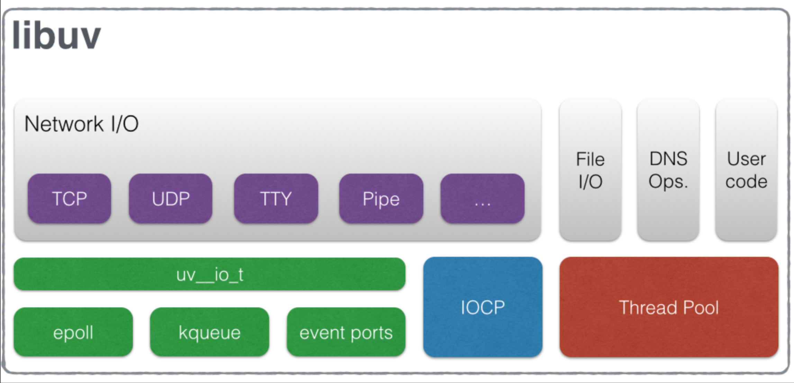

# libuv

## 架构

libuv是一个异步I/O的跨平台c库，主要用于nodejs中。libuv架构如下：



libuv提供了以下封装：

1. 异步的网络I/O
2. 异步的文件操作
3. 异步的DNS处理
4. 线程池
5. 基于epoll、kqueue、IOPC的I/O（事件）循环

## epoll

epoll是一种I/O事件通知机制，是linux 内核实现I/O多路复用的一个实现。相比较select、poll采用轮询的方式来检查文件描述符是否处于就绪态，epoll采用回调机制，它无须遍历整个被侦听的fd集合，只遍历那些被内核I/O事件异步唤醒而加入Ready队列的fd集合，因此能显著提高程序在大量并发连接中只有少量活跃的情况下的系统CPU利用率。


## eventloop

libuv会在来自操作系统的事件或者其他来源的事件发生的时候，调用相应的用户注册的回调函数。这个eventloop会一直保持运行状态：

```c
while 进程中仍然有剩余事件
  event = 事件队列中的下一个事件
  if event被关联了一个callback
    调用这个callback
```

这是一个异步非阻塞的方案。当然我们也可以使用多线程的办法来处理并发I/O。libuv的这种事件驱动的异步非阻塞方案在非cpu密集型任务中更为适用。

## handle

## request

## 线程池
