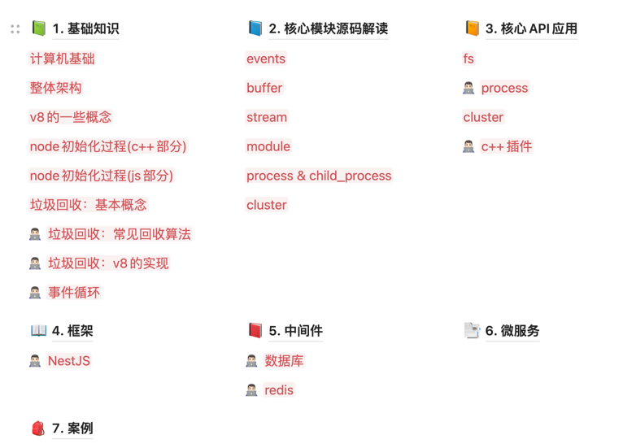

# NodeJS进阶：基础、源码、框架、应用

## 在线阅读

地址：[NodeJS进阶：基础、源码、框架、应用](https://www.wolai.com/o971owNmXWpCe8dFYfij3T)

## 目录

## 版本

- node `v16.14.0`
- nest.js `v8.x`

## 捐赠

如果您觉得我写的不错，

欢迎star我的github博客项目：

[https://github.com/wengzhisong-hz/learning-nodejs](https://github.com/wengzhisong-hz/learning-nodejs)

也可以请我喝一杯咖啡 ☕️：

