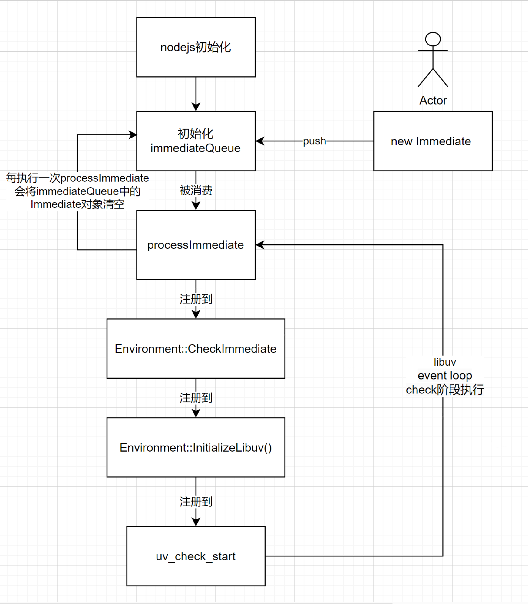

# setImmediate

`setImmediate`在nodejs中是在`libuv`的event-loop check阶段执行的定时器。

## 创建immediate

在`timer.js`中定义了`Immediate`类：

```javascript
class Immediate {
  constructor(callback, args) {
    this._idleNext = null;
    this._idlePrev = null;
    this._onImmediate = callback;
    this._argv = args;
    this._destroyed = false;
    this[kRefed] = false;

    initAsyncResource(this, 'Immediate');

    this.ref();
    immediateInfo[kCount]++;
    // immediate队列
    immediateQueue.append(this);
  }

  ref() {
    if (this[kRefed] === false) {
      this[kRefed] = true;
      if (immediateInfo[kRefCount]++ === 0)
        toggleImmediateRef(true);
    }
    return this;
  }

  unref() {
    if (this[kRefed] === true) {
      this[kRefed] = false;
      if (--immediateInfo[kRefCount] === 0)
        toggleImmediateRef(false);
    }
    return this;
  }

  hasRef() {
    return !!this[kRefed];
  }
}

```

在构造函数中，会将`Immediate`的实例添加到`immediateQueue`中，我们来看看这个队列：

```javascript
const immediateQueue = new ImmediateList();

class ImmediateList {
  constructor() {
    this.head = null;
    this.tail = null;
  }
  append(item) {
    if (this.tail !== null) {
      this.tail._idleNext = item;
      item._idlePrev = this.tail;
    } else {
      this.head = item;
    }
    this.tail = item;
  }
  remove(item) {
    if (item._idleNext) {
      item._idleNext._idlePrev = item._idlePrev;
    }

    if (item._idlePrev) {
      item._idlePrev._idleNext = item._idleNext;
    }

    if (item === this.head)
      this.head = item._idleNext;
    if (item === this.tail)
      this.tail = item._idlePrev;

    item._idleNext = null;
    item._idlePrev = null;
  }
}

```

`immediateQueue`实际上是一个双向链表。每个immediate实例都会被保存到这个双向队列中。

## 消费immediate

在`getTimerCallbacks`中，返回了`processImmediate`用于批量消费`immediateQueue`中的immediate：

```javascript
function getTimerCallbacks(runNextTicks) {

  const outstandingQueue = new ImmediateList();

  function processImmediate() {
    // 获取immediateQueue
    const queue = outstandingQueue.head !== null ?
      outstandingQueue : immediateQueue;
    // 从队列中取出头节点
    let immediate = queue.head;

    if (queue !== outstandingQueue) {
      queue.head = queue.tail = null;
      immediateInfo[kHasOutstanding] = 1;
    }

    let prevImmediate;
    let ranAtLeastOneImmediate = false;
    
    // 在一个while循环中
    while (immediate !== null) {
      if (ranAtLeastOneImmediate)
        runNextTicks();
      else
        ranAtLeastOneImmediate = true;
      // 如果当前的immediate执行完毕，
      // 取下一个immediate 
      if (immediate._destroyed) {
        outstandingQueue.head = immediate = prevImmediate._idleNext;
        continue;
      }
      immediate._destroyed = true;

      immediateInfo[kCount]--;
      if (immediate[kRefed])
        immediateInfo[kRefCount]--;
      immediate[kRefed] = null;

      prevImmediate = immediate;

      const asyncId = immediate[async_id_symbol];
      // async_hook 进行记录
      emitBefore(asyncId, immediate[trigger_async_id_symbol], immediate);
      
      // 执行 immediate的callback
      // Immediate类的构造函数中：this._onImmediate = callback
      try {
        const argv = immediate._argv;
        if (!argv)
          immediate._onImmediate();
        else
          immediate._onImmediate(...argv);
      } finally {
        immediate._onImmediate = null;

        if (destroyHooksExist())
          emitDestroy(asyncId);
        // 取下一个immediate 
        outstandingQueue.head = immediate = immediate._idleNext;
      }
      // async_hook 进行记录
      emitAfter(asyncId);
    }

    if (queue === outstandingQueue)
      outstandingQueue.head = null;
    immediateInfo[kHasOutstanding] = 0;
  }

 // ...

  return {
    processImmediate
  };
}
```

## 注册到libuv中

`processImmediate`在while循环中会清空`immediateQueue`中的所有immediate。在nodejs启动过程中，会将`processImmediate`作为参数传入c++模块`timers` 的`setupTimers`方法：

```javascript
// 在nodejs初始化过程中会执行下面的代码

const { setupTimers } = internalBinding('timers');
const {
  processImmediate,
  processTimers,
} = internalTimers.getTimerCallbacks(runNextTicks);

setupTimers(processImmediate, processTimers);
```

让我们看看`timer.cc`中的对应逻辑：

```c++
// 定义js的handle：setupTimers
SetMethod(context, target, "setupTimers", SetupTimers);

void SetupTimers(const FunctionCallbackInfo<Value>& args) {
  CHECK(args[0]->IsFunction());
  CHECK(args[1]->IsFunction());
  auto env = Environment::GetCurrent(args);
  // 将 processImmediate函数作为参数传入 set_immediate_callback_function
  env->set_immediate_callback_function(args[0].As<Function>());
  // processTimers
  env->set_timers_callback_function(args[1].As<Function>());
}

```

`set_immediate_callback_function`实际上是用env里面的宏定义的：

```c++
#define PER_REALM_STRONG_PERSISTENT_VALUES(V) \
  // ...
  V(immediate_callback_function, v8::Function) \
  // ...

```

调用`set_immediate_callback_function`实际上是调用了`env→immediate_callback_function()`。

在`env.cc`中，`Environment::CheckImmediate`会调用`env->immediate_callback_function()`：

```c++
void Environment::CheckImmediate(uv_check_t* handle) {
  Environment* env = Environment::from_immediate_check_handle(handle);
  TRACE_EVENT0(TRACING_CATEGORY_NODE1(environment), "CheckImmediate");

  HandleScope scope(env->isolate());
  Context::Scope context_scope(env->context());

  env->RunAndClearNativeImmediates();

  if (env->immediate_info()->count() == 0 || !env->can_call_into_js())
    return;
  // 在一个do while循环中
  // 会通过Async hook的MakeCallback去执行immediate_callback_function
  // MakeCallback仅是为了记录异步信息做的一层嵌套，别无它意
  do {
    MakeCallback(env->isolate(),
                 env->process_object(),
                 env->immediate_callback_function(),
                 0,
                 nullptr,
                 {0, 0}).ToLocalChecked();
  } while (env->immediate_info()->has_outstanding() && env->can_call_into_js());

  if (env->immediate_info()->ref_count() == 0)
    env->ToggleImmediateRef(false);
}
```

在`Environment::InitializeLibuv`中，

```c++
void Environment::InitializeLibuv() {
  HandleScope handle_scope(isolate());
  Context::Scope context_scope(context());

  // ...
  
  // 在uv_check_start中注册了CheckImmediate
  CHECK_EQ(0, uv_check_start(immediate_check_handle(), CheckImmediate));
  
  // ...
}
```

在libuv中，`uv_check_t`是在event loop的check阶段中执行的handle，`uv_check_start`函数接口为：

```c
int uv_check_start(uv_check_t* check, uv_check_cb cb)
```

它在check阶段执行传入的callback。

也就是说，在libuv的check阶段，会执行`Environment::CheckImmediate`，清空其中注册的immediate。

## 总结

我们可以总结出`immediate`的执行流程：


