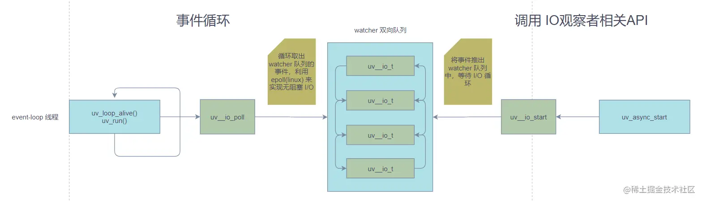

# libuv：I/O

## I/O时间分配

在进入I/O（轮询）阶段，event loop会先检查timer callback。默认情况下会在调用`epoll_wait`的时候添加一个超时时间：

```c
int uv_run(uv_loop_t* loop, uv_run_mode mode) {
  // ...
  while (r != 0 && loop->stop_flag == 0) {
    // ...
    timeout = 0;
    if ((mode == UV_RUN_ONCE && can_sleep) || mode == UV_RUN_DEFAULT)
        // 计算I/O超时时间
      timeout = uv__backend_timeout(loop);
    uv__io_poll(loop, timeout);
    // ...
  }
}
```

具体逻辑是：

```c
static int uv__backend_timeout(const uv_loop_t* loop) {
    // 当：
    // 没有活动的handle
    // 或:
    // 有活动的request 且 pending、idle、closing handle为空
    // 则 调用uv__next_timeout
    // 否则 返回0，不阻塞
  if (loop->stop_flag == 0 &&
      /* uv__loop_alive(loop) && */
      (uv__has_active_handles(loop) || uv__has_active_reqs(loop)) &&
      QUEUE_EMPTY(&loop->pending_queue) &&
      QUEUE_EMPTY(&loop->idle_handles) &&
      (loop->flags & UV_LOOP_REAP_CHILDREN) == 0 &&
      loop->closing_handles == NULL)
    return uv__next_timeout(loop);
  return 0;
}

int uv__next_timeout(const uv_loop_t* loop) {
  const struct heap_node* heap_node;
  const uv_timer_t* handle;
  uint64_t diff;
  // 从最小堆中获取最近将要过期的timer
  heap_node = heap_min(timer_heap(loop));
    // 如果堆中没有timer，则可以阻塞
  if (heap_node == NULL)
    return -1; /* block indefinitely */
    // 如果timer的过期时间小于一个event loop的时间，则不阻塞
  handle = container_of(heap_node, uv_timer_t, heap_node);
  if (handle->timeout <= loop->time)
    return 0;
  // 计算出阻塞时间
  diff = handle->timeout - loop->time;
  if (diff > INT_MAX)
    diff = INT_MAX;

  return (int) diff;
}
```

最后这个时间会被传入`epoll_wait`的timeout参数：

```c
int epoll_wait(int epfd, struct epoll_event *events, int maxevents, int timeout);
```

这个timeout为-1的时候，表示本次轮询阻塞至fd就绪，0表示立即返回，不阻塞；如果设定上面传过来的diff，则表示等待diff后，如果此时fd还未就绪则返回。返回之后，不会再阻塞线程，等待fd就绪之后再行处理即可。

简单的说，libuv会合理分配I/O与timer的时间。当有要过期的timer的时候，会轮询阻塞一小段不影响timer的时间，这段时间之后再执行timer。

不难看出，libuv会尽可能的维持处于I/O的状态。

## I/O观察者

libuv的I/O handle基于观察者模式。我来来大致了解下：

```c
struct uv__io_s {
    // 回调
  uv__io_cb cb;
    // pending的事件队列
  void* pending_queue[2];
    // 观察者队列
  void* watcher_queue[2];
    // 被pending的事件
  unsigned int pevents; /* Pending event mask i.e. mask at next tick. */
    // 当前的事件
  unsigned int events;  /* Current event mask. */
  int fd;
  UV_IO_PRIVATE_PLATFORM_FIELDS
};

typedef struct uv__io_s uv__io_t;

// 初始化观察者
void uv__io_init(uv__io_t* w, uv__io_cb cb, int fd) {
  assert(cb != NULL);
  assert(fd >= -1);
  QUEUE_INIT(&w->pending_queue);
  QUEUE_INIT(&w->watcher_queue);
  w->cb = cb;
  w->fd = fd;
  w->events = 0;
  w->pevents = 0;
}

```

## 注册、移除I/O观察者

注册：

```c
void uv__io_start(uv_loop_t* loop, uv__io_t* w, unsigned int events) {
  assert(0 == (events & ~(POLLIN | POLLOUT | UV__POLLRDHUP | UV__POLLPRI)));
  assert(0 != events);
  assert(w->fd >= 0);
  assert(w->fd < INT_MAX);

  w->pevents |= events;
  maybe_resize(loop, w->fd + 1);

#if !defined(__sun)
  if (w->events == w->pevents)
    return;
#endif

  if (QUEUE_EMPTY(&w->watcher_queue))
    QUEUE_INSERT_TAIL(&loop->watcher_queue, &w->watcher_queue);

  if (loop->watchers[w->fd] == NULL) {
      // 将I/O观察者映射到loop->watchers中
    loop->watchers[w->fd] = w;
    loop->nfds++;
  }
}
```

移除：

```c
void uv__io_stop(uv_loop_t* loop, uv__io_t* w, unsigned int events) {
  assert(0 == (events & ~(POLLIN | POLLOUT | UV__POLLRDHUP | UV__POLLPRI)));
  assert(0 != events);

  if (w->fd == -1)
    return;

  assert(w->fd >= 0);

  if ((unsigned) w->fd >= loop->nwatchers)
    return;

  w->pevents &= ~events;
    // 当没有pending的事件
  if (w->pevents == 0) {
    QUEUE_REMOVE(&w->watcher_queue);
    QUEUE_INIT(&w->watcher_queue);
    w->events = 0;

    if (w == loop->watchers[w->fd]) {
      assert(loop->nfds > 0);
        // 移除观察者的映射关系
      loop->watchers[w->fd] = NULL;
      loop->nfds--;
    }
  }
  else if (QUEUE_EMPTY(&w->watcher_queue))
    QUEUE_INSERT_TAIL(&loop->watcher_queue, &w->watcher_queue);
}
```

## 执行I/O轮询

让我们来看下event loop中`uv__io_poll`发生了什么：

```c
void uv__io_poll(uv_loop_t* loop, int timeout) {
  /* A bug in kernels < 2.6.37 makes timeouts larger than ~30 minutes
   * effectively infinite on 32 bits architectures.  To avoid blocking
   * indefinitely, we cap the timeout and poll again if necessary.
   *
   * Note that "30 minutes" is a simplification because it depends on
   * the value of CONFIG_HZ.  The magic constant assumes CONFIG_HZ=1200,
   * that being the largest value I have seen in the wild (and only once.)
   */
  static const int max_safe_timeout = 1789569;
  static int no_epoll_pwait_cached;
  static int no_epoll_wait_cached;
  int no_epoll_pwait;
  int no_epoll_wait;
  struct epoll_event events[1024];
  struct epoll_event* pe;
  struct epoll_event e;
  int real_timeout;
  QUEUE* q;
  uv__io_t* w;
  sigset_t sigset;
  uint64_t sigmask;
  uint64_t base;
  int have_signals;
  int nevents;
  int count;
  int nfds;
  int fd;
  int op;
  int i;
  int user_timeout;
  int reset_timeout;

  if (loop->nfds == 0) {
    assert(QUEUE_EMPTY(&loop->watcher_queue));
    return;
  }

  memset(&e, 0, sizeof(e));

  while (!QUEUE_EMPTY(&loop->watcher_queue)) {
    q = QUEUE_HEAD(&loop->watcher_queue);
    QUEUE_REMOVE(q);
    QUEUE_INIT(q);

    w = QUEUE_DATA(q, uv__io_t, watcher_queue);
    assert(w->pevents != 0);
    assert(w->fd >= 0);
    assert(w->fd < (int) loop->nwatchers);

    e.events = w->pevents;
    e.data.fd = w->fd;

    if (w->events == 0)
      op = EPOLL_CTL_ADD;
    else
      op = EPOLL_CTL_MOD;

    /* XXX Future optimization: do EPOLL_CTL_MOD lazily if we stop watching
     * events, skip the syscall and squelch the events after epoll_wait().
     */
    if (epoll_ctl(loop->backend_fd, op, w->fd, &e)) {
      if (errno != EEXIST)
        abort();

      assert(op == EPOLL_CTL_ADD);

      /* We've reactivated a file descriptor that's been watched before. */
      if (epoll_ctl(loop->backend_fd, EPOLL_CTL_MOD, w->fd, &e))
        abort();
    }

    w->events = w->pevents;
  }

  sigmask = 0;
  if (loop->flags & UV_LOOP_BLOCK_SIGPROF) {
    sigemptyset(&sigset);
    sigaddset(&sigset, SIGPROF);
    sigmask |= 1 << (SIGPROF - 1);
  }

  assert(timeout >= -1);
  base = loop->time;
  count = 48; /* Benchmarks suggest this gives the best throughput. */
  real_timeout = timeout;

  if (uv__get_internal_fields(loop)->flags & UV_METRICS_IDLE_TIME) {
    reset_timeout = 1;
    user_timeout = timeout;
    timeout = 0;
  } else {
    reset_timeout = 0;
    user_timeout = 0;
  }

  /* You could argue there is a dependency between these two but
   * ultimately we don't care about their ordering with respect
   * to one another. Worst case, we make a few system calls that
   * could have been avoided because another thread already knows
   * they fail with ENOSYS. Hardly the end of the world.
   */
  no_epoll_pwait = uv__load_relaxed(&no_epoll_pwait_cached);
  no_epoll_wait = uv__load_relaxed(&no_epoll_wait_cached);

  for (;;) {
    /* Only need to set the provider_entry_time if timeout != 0. The function
     * will return early if the loop isn't configured with UV_METRICS_IDLE_TIME.
     */
    if (timeout != 0)
      uv__metrics_set_provider_entry_time(loop);

    /* See the comment for max_safe_timeout for an explanation of why
     * this is necessary.  Executive summary: kernel bug workaround.
     */
    if (sizeof(int32_t) == sizeof(long) && timeout >= max_safe_timeout)
      timeout = max_safe_timeout;

    if (sigmask != 0 && no_epoll_pwait != 0)
      if (pthread_sigmask(SIG_BLOCK, &sigset, NULL))
        abort();

    if (no_epoll_wait != 0 || (sigmask != 0 && no_epoll_pwait == 0)) {
      nfds = epoll_pwait(loop->backend_fd,
                         events,
                         ARRAY_SIZE(events),
                         timeout,
                         &sigset);
      if (nfds == -1 && errno == ENOSYS) {
        uv__store_relaxed(&no_epoll_pwait_cached, 1);
        no_epoll_pwait = 1;
      }
    } else {
      nfds = epoll_wait(loop->backend_fd,
                        events,
                        ARRAY_SIZE(events),
                        timeout);
      if (nfds == -1 && errno == ENOSYS) {
        uv__store_relaxed(&no_epoll_wait_cached, 1);
        no_epoll_wait = 1;
      }
    }

    if (sigmask != 0 && no_epoll_pwait != 0)
      if (pthread_sigmask(SIG_UNBLOCK, &sigset, NULL))
        abort();

    /* Update loop->time unconditionally. It's tempting to skip the update when
     * timeout == 0 (i.e. non-blocking poll) but there is no guarantee that the
     * operating system didn't reschedule our process while in the syscall.
     */
    SAVE_ERRNO(uv__update_time(loop));

    if (nfds == 0) {
      assert(timeout != -1);

      if (reset_timeout != 0) {
        timeout = user_timeout;
        reset_timeout = 0;
      }

      if (timeout == -1)
        continue;

      if (timeout == 0)
        return;

      /* We may have been inside the system call for longer than |timeout|
       * milliseconds so we need to update the timestamp to avoid drift.
       */
      goto update_timeout;
    }

    if (nfds == -1) {
      if (errno == ENOSYS) {
        /* epoll_wait() or epoll_pwait() failed, try the other system call. */
        assert(no_epoll_wait == 0 || no_epoll_pwait == 0);
        continue;
      }

      if (errno != EINTR)
        abort();

      if (reset_timeout != 0) {
        timeout = user_timeout;
        reset_timeout = 0;
      }

      if (timeout == -1)
        continue;

      if (timeout == 0)
        return;

      /* Interrupted by a signal. Update timeout and poll again. */
      goto update_timeout;
    }

    have_signals = 0;
    nevents = 0;

    {
      /* Squelch a -Waddress-of-packed-member warning with gcc >= 9. */
      union {
        struct epoll_event* events;
        uv__io_t* watchers;
      } x;

      x.events = events;
      assert(loop->watchers != NULL);
      loop->watchers[loop->nwatchers] = x.watchers;
      loop->watchers[loop->nwatchers + 1] = (void*) (uintptr_t) nfds;
    }

    for (i = 0; i < nfds; i++) {
      pe = events + i;
      fd = pe->data.fd;

      /* Skip invalidated events, see uv__platform_invalidate_fd */
      if (fd == -1)
        continue;

      assert(fd >= 0);
      assert((unsigned) fd < loop->nwatchers);

      w = loop->watchers[fd];

      if (w == NULL) {
        /* File descriptor that we've stopped watching, disarm it.
         *
         * Ignore all errors because we may be racing with another thread
         * when the file descriptor is closed.
         */
        epoll_ctl(loop->backend_fd, EPOLL_CTL_DEL, fd, pe);
        continue;
      }

      /* Give users only events they're interested in. Prevents spurious
       * callbacks when previous callback invocation in this loop has stopped
       * the current watcher. Also, filters out events that users has not
       * requested us to watch.
       */
      pe->events &= w->pevents | POLLERR | POLLHUP;

      /* Work around an epoll quirk where it sometimes reports just the
       * EPOLLERR or EPOLLHUP event.  In order to force the event loop to
       * move forward, we merge in the read/write events that the watcher
       * is interested in; uv__read() and uv__write() will then deal with
       * the error or hangup in the usual fashion.
       *
       * Note to self: happens when epoll reports EPOLLIN|EPOLLHUP, the user
       * reads the available data, calls uv_read_stop(), then sometime later
       * calls uv_read_start() again.  By then, libuv has forgotten about the
       * hangup and the kernel won't report EPOLLIN again because there's
       * nothing left to read.  If anything, libuv is to blame here.  The
       * current hack is just a quick bandaid; to properly fix it, libuv
       * needs to remember the error/hangup event.  We should get that for
       * free when we switch over to edge-triggered I/O.
       */
      if (pe->events == POLLERR || pe->events == POLLHUP)
        pe->events |=
          w->pevents & (POLLIN | POLLOUT | UV__POLLRDHUP | UV__POLLPRI);

      if (pe->events != 0) {
        /* Run signal watchers last.  This also affects child process watchers
         * because those are implemented in terms of signal watchers.
         */
        if (w == &loop->signal_io_watcher) {
          have_signals = 1;
        } else {
          uv__metrics_update_idle_time(loop);
          w->cb(loop, w, pe->events);
        }

        nevents++;
      }
    }

    uv__metrics_inc_events(loop, nevents);
    if (reset_timeout != 0) {
      timeout = user_timeout;
      reset_timeout = 0;
      uv__metrics_inc_events_waiting(loop, nevents);
    }

    if (have_signals != 0) {
      uv__metrics_update_idle_time(loop);
      loop->signal_io_watcher.cb(loop, &loop->signal_io_watcher, POLLIN);
    }

    loop->watchers[loop->nwatchers] = NULL;
    loop->watchers[loop->nwatchers + 1] = NULL;

    if (have_signals != 0)
      return;  /* Event loop should cycle now so don't poll again. */

    if (nevents != 0) {
      if (nfds == ARRAY_SIZE(events) && --count != 0) {
        /* Poll for more events but don't block this time. */
        timeout = 0;
        continue;
      }
      return;
    }

    if (timeout == 0)
      return;

    if (timeout == -1)
      continue;

update_timeout:
    assert(timeout > 0);

    real_timeout -= (loop->time - base);
    if (real_timeout <= 0)
      return;

    timeout = real_timeout;
  }
}
```

整体的流程如下：

-   遍历I/O观察者队列，初始化epoll\_event，然后通过epoll\_ctl修改fd上的事件
-   调用epoll\_wait来监控fd上产生的事件
-   处理I/O，执行io观察者里保存的cb

流程如下：


