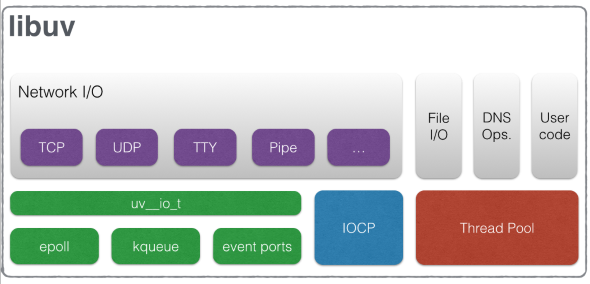

# libuv：简介

## 架构

libuv是一个异步I/O的跨平台c库，主要用于nodejs中。libuv架构如下：



libuv提供了以下封装：

1.  异步的网络I/O
2.  异步的文件操作
3.  异步的DNS处理
4.  线程池
5.  基于epoll、kqueue、IOPC的I/O（事件）循环

## epoll

epoll是一种I/O事件通知机制，是linux 内核实现I/O多路复用的一个实现。相比较select、poll采用轮询的方式来检查文件描述符是否处于就绪态，epoll采用回调机制，它无须遍历整个被侦听的fd集合，只遍历那些被内核I/O事件异步唤醒而加入Ready队列的fd集合，因此能显著提高程序在大量并发连接中只有少量活跃的情况下的系统CPU利用率。


## eventloop

libuv会在来自操作系统的事件或者其他来源的事件发生的时候，调用相应的用户注册的回调函数。这个eventloop会一直保持运行状态：

```c
while 进程中仍然有剩余事件
  event = 事件队列中的下一个事件
  if event被关联了一个callback
    调用这个callback
```

这是一个异步非阻塞的方案。当然我们也可以使用多线程的办法来处理并发I/O。libuv的这种事件驱动的异步非阻塞方案在非cpu密集型任务中更为适用。

libuv的event loop在`src/unix/core.c`（以unix环境为例）中实现如下：

```c
int uv_run(uv_loop_t* loop, uv_run_mode mode) {
  int timeout;
  int r;
  int can_sleep;
  // 如果还有活跃的 handle
  r = uv__loop_alive(loop);
  if (!r)
    uv__update_time(loop);
  // 会在这个while寻转中进行处理
  while (r != 0 && loop->stop_flag == 0) {
    uv__update_time(loop); // 更新loop->time
    uv__run_timers(loop); // 处理timers handle

    can_sleep =
        QUEUE_EMPTY(&loop->pending_queue) && QUEUE_EMPTY(&loop->idle_handles);

    uv__run_pending(loop); // 处理pending handle
    uv__run_idle(loop); // 处理idle handle
    uv__run_prepare(loop); // 处理prepare handle
    
    timeout = 0;
    // 获取轮询阻塞时间
    if ((mode == UV_RUN_ONCE && can_sleep) || mode == UV_RUN_DEFAULT)
      timeout = uv__backend_timeout(loop);

    uv__metrics_inc_loop_count(loop);

    uv__io_poll(loop, timeout); // I/O轮询

    for (r = 0; r < 8 && !QUEUE_EMPTY(&loop->pending_queue); r++)
      uv__run_pending(loop);

    uv__metrics_update_idle_time(loop);

    uv__run_check(loop); // 处理check handle
    uv__run_closing_handles(loop); // 处理close handle

    if (mode == UV_RUN_ONCE) {
      uv__update_time(loop);
      uv__run_timers(loop);
    }

    r = uv__loop_alive(loop);
    if (mode == UV_RUN_ONCE || mode == UV_RUN_NOWAIT)
      break;
  }

  if (loop->stop_flag != 0)
    loop->stop_flag = 0;

  return r;
}

```

具体的流程如下：


## handle

我们可以看到在event loop中，处理了许多的handle，那么handle是什么呢？handle表示`能够在活动时执行特定操作的长期存在对象`。我们可以理解为：

-   handle是libuv封装的一种数据结构
-   handle有它自己的生命周期
-   用于进行特定操作，如轮询、计时器、进程等

libuv中包含如下handle：

```c
/* Handle types. */
typedef struct uv_loop_s uv_loop_t;
typedef struct uv_handle_s uv_handle_t;
typedef struct uv_stream_s uv_stream_t;
typedef struct uv_tcp_s uv_tcp_t;
typedef struct uv_udp_s uv_udp_t;
typedef struct uv_pipe_s uv_pipe_t;
typedef struct uv_tty_s uv_tty_t;
typedef struct uv_poll_s uv_poll_t;
typedef struct uv_timer_s uv_timer_t;
typedef struct uv_prepare_s uv_prepare_t;
typedef struct uv_check_s uv_check_t;
typedef struct uv_idle_s uv_idle_t;
typedef struct uv_async_s uv_async_t;
typedef struct uv_process_s uv_process_t;
typedef struct uv_fs_event_s uv_fs_event_t;
typedef struct uv_fs_poll_s uv_fs_poll_t;
typedef struct uv_signal_s uv_signal_t;
```

在`uv.h`中定义了handle的基类：

```c
#define UV_HANDLE_FIELDS \
  /* public */       \
  void* data;      \   // 用户自定义数据
  /* read-only */     \  
  uv_loop_t* loop;    \  // handle所属的event loop
  uv_handle_type type;  \  // handle类型
  /* private */      \  
  uv_close_cb close_cb;  \  // handle关闭时的回调函数
  void* handle_queue[2];\  // handle双向队列指针
  union {        \
    int fd;        \  // 文件描述符
    void* reserved[4];  \
  } u;          \
  UV_HANDLE_PRIVATE_FIELDS \
      
      
#define UV_HANDLE_PRIVATE_FIELDS  \
  uv_handle_t* next_closing;    \  // 下一个需要关闭的handle
  unsigned int flags;          \  // handle状态标记
```

## request

这里得提下request，request是一个临时的对象，一个request只会触发一次响应事件。request一般会关联到某个handle上，如果没有的话则会被传入event loop队列。
