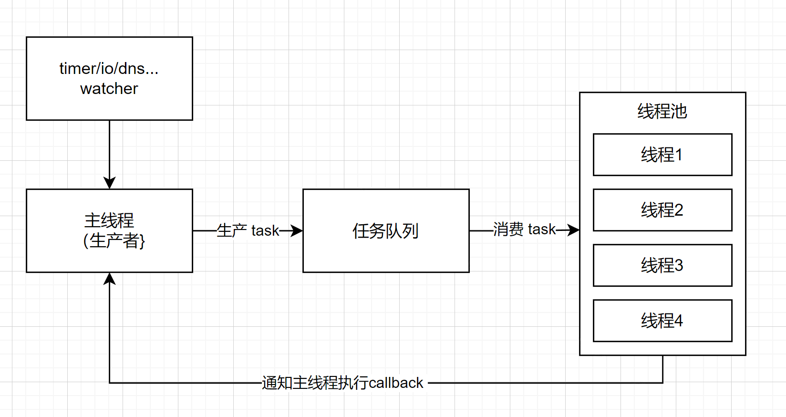

# libuv：线程池

## 生产者-消费者模型

libuv的线程池包括两个部分：主线程和线程池。主线程的主要工作是生产任务，即将如timer队列、io队列中的watcher（fd及对应的callback）提交到任务队列中。线程池从任务队列中获取watcher对象，然后进行处理。处理完毕之后，通知主线程执行可能的callback。



## 创建线程池

```c++
static void init_threads(void) {
  uv_thread_options_t config;
  unsigned int i;
  const char* val;
  uv_sem_t sem;
  
  // 设置线程个数，默认为4个，最多为 MAX_THREADPOOL_SIZE 128个
  nthreads = ARRAY_SIZE(default_threads);
  val = getenv("UV_THREADPOOL_SIZE");
  if (val != NULL)
    nthreads = atoi(val);
  if (nthreads == 0)
    nthreads = 1;
  if (nthreads > MAX_THREADPOOL_SIZE)
    nthreads = MAX_THREADPOOL_SIZE;

  threads = default_threads;
  if (nthreads > ARRAY_SIZE(default_threads)) {
    threads = uv__malloc(nthreads * sizeof(threads[0]));
    if (threads == NULL) {
      nthreads = ARRAY_SIZE(default_threads);
      threads = default_threads;
    }
  }
  // 初始化条件变量
  if (uv_cond_init(&cond))
    abort();
  // 初始化锁
  if (uv_mutex_init(&mutex))
    abort();
    
  // 初始化任务队列
  QUEUE_INIT(&wq);
  QUEUE_INIT(&slow_io_pending_wq);
  QUEUE_INIT(&run_slow_work_message);

  if (uv_sem_init(&sem, 0))
    abort();

  config.flags = UV_THREAD_HAS_STACK_SIZE;
  config.stack_size = 8u << 20;  /* 8 MB */
  
  // 初始化线程池
  for (i = 0; i < nthreads; i++)
    // 初始化每个线程的 worker
    if (uv_thread_create_ex(threads + i, &config, worker, &sem))
      abort();

  for (i = 0; i < nthreads; i++)
    uv_sem_wait(&sem);

  uv_sem_destroy(&sem);
}
```

## 消费任务

```c++
static void worker(void* arg) {
  struct uv__work* w;
  QUEUE* q;
  int is_slow_work;
  
  // ...
  
  // 上锁
  uv_mutex_lock(&mutex);
  for (;;) {
    // 当任务队列空了
    // 或队列里只有慢io且数量达到阈值
    // 会保持等待状态，空闲线程+1
    while (QUEUE_EMPTY(&wq) ||
           (QUEUE_HEAD(&wq) == &run_slow_work_message &&
            QUEUE_NEXT(&run_slow_work_message) == &wq &&
            slow_io_work_running >= slow_work_thread_threshold())) {
      idle_threads += 1;
      
      // 阻塞
      uv_cond_wait(&cond, &mutex);
      
      // 被唤醒之后空闲线程-1
      idle_threads -= 1;
    }
    
    // 从任务队列中取出一个任务
    q = QUEUE_HEAD(&wq);
    if (q == &exit_message) {
      uv_cond_signal(&cond);
      uv_mutex_unlock(&mutex);
      break;
    }
    // 并移除这个任务
    QUEUE_REMOVE(q);
    QUEUE_INIT(q);
    
    // ...
    
    // 释放锁
    uv_mutex_unlock(&mutex);
    
    // 获取uv__work对象，并执行work
    w = QUEUE_DATA(q, struct uv__work, wq);
    // 可能会造成阻塞
    w->work(w);
    
    // 对loop队列加锁
    uv_mutex_lock(&w->loop->wq_mutex);
    w->work = NULL; 
    
    // 将执行完的任务挂载到主线成loop->wq中，并通知主线程该任务执行完毕
    QUEUE_INSERT_TAIL(&w->loop->wq, &w->wq);
    uv_async_send(&w->loop->wq_async);
    uv_mutex_unlock(&w->loop->wq_mutex);
    // 准备下一个循环
    uv_mutex_lock(&mutex);
    if (is_slow_work) {
      
      slow_io_work_running--;
    }
  }
}
```

worker从任务队列中获取任务，并执行任务，完毕之后通知到主线程。

## 生产任务

```c++
enum uv__work_kind {
  // cpu计算操作
  UV__WORK_CPU,
  // 快io（如文件操作
  UV__WORK_FAST_IO,
  // 慢io（如dns解析
  UV__WORK_SLOW_IO
};
void uv__work_submit(uv_loop_t* loop,
                     struct uv__work* w,
                     enum uv__work_kind kind,
                     void (*work)(struct uv__work* w),
                     void (*done)(struct uv__work* w, int status)) {
  uv_once(&once, init_once);
  w->loop = loop;
  w->work = work;
  w->done = done;
  // 提交
  post(&w->wq, kind);
}

static void post(QUEUE* q, enum uv__work_kind kind) {
  uv_mutex_lock(&mutex);
  // 处理慢io
  if (kind == UV__WORK_SLOW_IO) {
    // 插入到单独的慢io队列
    QUEUE_INSERT_TAIL(&slow_io_pending_wq, q);
    if (!QUEUE_EMPTY(&run_slow_work_message)) {
      uv_mutex_unlock(&mutex);
      return;
    }
    q = &run_slow_work_message;
  }

  QUEUE_INSERT_TAIL(&wq, q);
  if (idle_threads > 0)
    uv_cond_signal(&cond);
  uv_mutex_unlock(&mutex);
}

```

libuv会按照任务的类型（快io、慢io、cpu计算任务）来提交任务。
