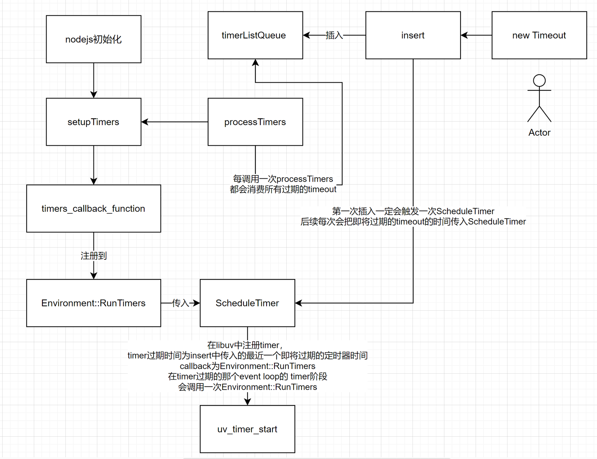

# setTimeout

## 创建setTimeout

在`/lib/timer.js`中定义了setTimeout：

```javascript
function setTimeout(callback, after, arg1, arg2, arg3) {
  validateFunction(callback, 'callback');

  let i, args;
  switch (arguments.length) {
    // fast cases
    case 1:
    case 2:
      break;
    case 3:
      args = [arg1];
      break;
    case 4:
      args = [arg1, arg2];
      break;
    default:
      args = [arg1, arg2, arg3];
      for (i = 5; i < arguments.length; i++) {
        // Extend array dynamically, makes .apply run much faster in v6.0.0
        args[i - 2] = arguments[i];
      }
      break;
  }
  // 创建timeout对象
  const timeout = new Timeout(callback, after, args, false, true);
  // 将timeout插入到优先队列中
  insert(timeout, timeout._idleTimeout);

  return timeout;
}
```

在`/internal/timer.js`中定义了Timeout和insert：

```javascript
class Timeout {

  constructor(callback, after, args, isRepeat, isRefed) {
    
    // ...

    this._idleTimeout = after;
    this._idlePrev = this;
    this._idleNext = this;
    this._idleStart = null;
    // This must be set to null first to avoid function tracking
    // on the hidden class, revisit in V8 versions after 6.2
    this._onTimeout = null;
    this._onTimeout = callback;
    this._timerArgs = args;
    this._repeat = isRepeat ? after : null;
    this._destroyed = false;

    if (isRefed)
      incRefCount();
    this[kRefed] = isRefed;
    this[kHasPrimitive] = false;

    initAsyncResource(this, 'Timeout');
  }

  // ...
}

let nextExpiry = Infinity;

function insert(item, msecs, start = getLibuvNow()) {
  msecs = MathTrunc(msecs);
  item._idleStart = start;
  let list = timerListMap[msecs];
  if (list === undefined) {
    const expiry = start + msecs;
    
    // 将timeout对象插入到优先队列中
    
    timerListMap[msecs] = list = new TimersList(expiry, msecs);
    timerListQueue.insert(list);
    
    // 第一次一定会执行 scheduleTimer
    // 每次插入新的timeout，都会和最近一个即将过期的timeout进行对比
    // 会尽快执行即将过期的timout
    if (nextExpiry > expiry) {
      // scheduleTimer是c++模块
      // const { scheduleTimer } = internalBinding('timers');
      scheduleTimer(msecs);
      nextExpiry = expiry;
    }
  }

  L.append(list, item);
}

```

## setTimeout中的优先队列

`timerListMap`和`timerListQueue`何许人也？在[libuv：timer](../libuv：timer/libuv：timer.md "libuv：timer")中我们介绍到，libuv中的timer是存储在最小堆中，以便每次获取到最近过期的那个timer handle。同理，setTimeout的执行时机也是在它过期的时候，nodejs中用优先队列来存储timeout对象，以便获取到最近过期的timeout对象。

通常，使用二叉堆实现的优先队列获取到最小或最大值的时间复杂度为`O(1)`，而查找一个对象的复杂度为`O(log(n))`。nodejs中采用了`hashMap`辅助的方式来将查找操作的时间复杂度降低到`O(1)`。

```javascript
// This is a priority queue with a custom sorting function that first compares
// the expiry times of two lists and if they're the same then compares their
// individual IDs to determine which list was created first.
const timerListQueue = new PriorityQueue(compareTimersLists, setPosition);

// Object map containing linked lists of timers, keyed and sorted by their
// duration in milliseconds.
//
// - key = time in milliseconds
// - value = linked list
const timerListMap = { __proto__: null };
```

## 消费timeout

同上文[setImmediate](../setImmediate/setImmediate.md "setImmediate")中的消费immediate，在`getTimerCallbacks`中同样注册了批量消费timeout对象的`processTimers`：

```javascript
function getTimerCallbacks(runNextTicks) {

  // ...
  
  function processTimers(now) {
    debug('process timer lists %d', now);
    nextExpiry = Infinity;

    let list;
    let ranAtLeastOneList = false;
    // 在while循环中
    while ((list = timerListQueue.peek()) != null) {
      // 取出所有过期的timeout进行消费
      if (list.expiry > now) {
        nextExpiry = list.expiry;
        return timeoutInfo[0] > 0 ? nextExpiry : -nextExpiry;
      }
      if (ranAtLeastOneList)
        runNextTicks();
      else
        ranAtLeastOneList = true;
      listOnTimeout(list, now);
    }
    return 0;
  }

  function listOnTimeout(list, now) {
    const msecs = list.msecs;

    debug('timeout callback %d', msecs);

    let ranAtLeastOneTimer = false;
    let timer;
    // 将过期的timoe list中的timeout挨个取出
    while ((timer = L.peek(list)) != null) {
      const diff = now - timer._idleStart;

      if (diff < msecs) {
        list.expiry = MathMax(timer._idleStart + msecs, now + 1);
        list.id = timerListId++;
        timerListQueue.percolateDown(1);
        debug('%d list wait because diff is %d', msecs, diff);
        return;
      }

      if (ranAtLeastOneTimer)
        runNextTicks();
      else
        ranAtLeastOneTimer = true;

      L.remove(timer);

      const asyncId = timer[async_id_symbol];

      if (!timer._onTimeout) {
        if (!timer._destroyed) {
          timer._destroyed = true;

          if (timer[kRefed])
            timeoutInfo[0]--;

          if (destroyHooksExist())
            emitDestroy(asyncId);
        }
        continue;
      }

      emitBefore(asyncId, timer[trigger_async_id_symbol], timer);

      let start;
      if (timer._repeat)
        start = getLibuvNow();
      
      // 调用timeout对象的callback
      
      try {
        const args = timer._timerArgs;
        if (args === undefined)
          timer._onTimeout();
        else
          ReflectApply(timer._onTimeout, timer, args);
      } finally {
      
      // setInterval
      // 会重新插入到优先队列中
      
        if (timer._repeat && timer._idleTimeout !== -1) {
          timer._idleTimeout = timer._repeat;
          insert(timer, timer._idleTimeout, start);
        } else if (!timer._idleNext && !timer._idlePrev && !timer._destroyed) {
          timer._destroyed = true;

          if (timer[kRefed])
            timeoutInfo[0]--;

          if (destroyHooksExist())
            emitDestroy(asyncId);
        }
      }

      emitAfter(asyncId);
    }

    debug('%d list empty', msecs);

    if (list === timerListMap[msecs]) {
      delete timerListMap[msecs];
      timerListQueue.shift();
    }
  }

  return {
    processTimers
  };
}
```

## 注册到libuv中

同样的，在nodejs初始化过程中会注册processTimers：

```javascript
// 在nodejs初始化过程中会执行下面的代码

const { setupTimers } = internalBinding('timers');
const {
  processImmediate,
  processTimers,
} = internalTimers.getTimerCallbacks(runNextTicks);

setupTimers(processImmediate, processTimers);
```

`processTimers`会被注册到`timers_callback_function`中：

```c++
void SetupTimers(const FunctionCallbackInfo<Value>& args) {
  CHECK(args[0]->IsFunction());
  CHECK(args[1]->IsFunction());
  auto env = Environment::GetCurrent(args);

  env->set_immediate_callback_function(args[0].As<Function>());
  // processTimers
  env->set_timers_callback_function(args[1].As<Function>());
}
```

最终会在`Environment::RunTimers`中执行`timers_callback_function`

```c++
void Environment::RunTimers(uv_timer_t* handle) {

  // ...
  // 取出js callback
  Local<Function> cb = env->timers_callback_function();
  // 执行js 的callback
  do {
    TryCatchScope try_catch(env);
    try_catch.SetVerbose(true);
    ret = cb->Call(env->context(), process, 1, &arg);
  } while (ret.IsEmpty() && env->can_call_into_js());

}
```

在创建setTimeout的`insert`方法中，有调用`scheduleTimer`，且必然会在第一次插入timeout对象的时候触发`scheduleTimer`。`scheduleTimer`逻辑如下：

```c++
void ScheduleTimer(const FunctionCallbackInfo<Value>& args) {
  auto env = Environment::GetCurrent(args);
  env->ScheduleTimer(args[0]->IntegerValue(env->context()).FromJust());
}

// 最终调用到这部分代码
void Environment::ScheduleTimer(int64_t duration_ms) {
  if (started_cleanup_) return;
  // 在libuv中，注册了RunTimers
  // 在event loop的timer阶段，会执行一次RunTimers
  uv_timer_start(timer_handle(), RunTimers, duration_ms, 0);
}

```

## 总结


