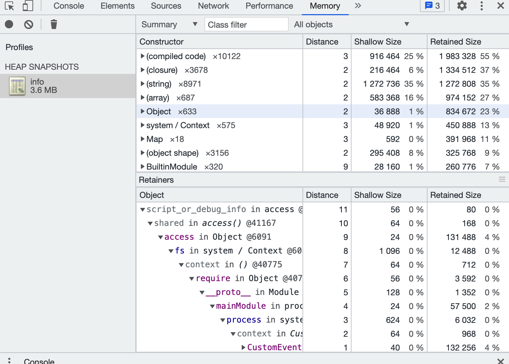

# 内存监控

## 获取node进程内存信息的一些方法

### `process.memoryUsage()`

`process.memoryUsage()`返回值如下：

-   `rss`：常驻集大小，进程在主内存设备中所占的空间，包括所有的c++和js对象和代码
-   `heapTotal`：v8的内存总量
-   `heapUsed`：v8的内存使用量
-   `external`：绑定到 v8 管理的 js 对象的 c++ 对象的内存使用量
-   `arrayBuffers`：buffer所占用的内存

### `v8.getHeapSnapshot()`

node 11.13.0版本添加了这个功能，用于生成当前v8堆的快照，以可读流的形式返回json序列化之后的数据，可以用chrome devtools来加载分析该堆快照数据。

生成快照需要的内存是创建快照那一刻，堆内存的两倍。这个可能会导致OOM。

#### 使用方法

执行下列文件：

```javascript
const v8 = require('node:v8');
const stream = v8.getHeapSnapshot();

const fs = require("fs")
stream.pipe(fs.createWriteStream("./info.heapsnapshot"));

```

得到一个`.heapsnapshot`文件，然后在chrome devtools中的Memory tab中选择load按钮加载该文件：



其中:

-   Constructor：对象的构造函数
-   Distance：从root节点到该对象的最小路径
-   Shallow Size：对象自身大小
-   Retained Size：移除对象的时候，会释放的内存空间（如果b只依赖a，那么移除a的时候，也会释放b）

当我们发现某个对象的`Retained Size`特别大的时候，那么就可能存在内存泄漏。

### 手动gc

可以在运行node进程的时候加上`--expose-gc `，那么在nodejs代码中可以手动调用`global.gc()`发起gc。如果gc之后内存占用仍然很高（相比较服务刚运行的时候），那么也可能存在内存泄漏。

### heapdump

node版本低于11.13.0，则可以使用heapdump来获取v8堆内存信息：

```javascript
const heapdump = require('heapdump');
heapdump.writeSnapshot('/var/local/' + Date.now() + '.heapsnapshot');
```

使用方式同`v8.getHeapSnapshot()`。

## alinode

alinode提供了性能监控、安全提醒、故障排查、性能优化等服务的整体性解决方案。开发者无需在代码中嵌入获取快照的代码，就能够获取到内存信息。在生产中比较推荐使用alinode。
