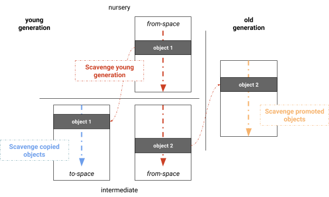

# 垃圾回收：v8的实现

# 垃圾回收：v8 的实现

前两章我们了解了一些垃圾回收的基础知识和常见的优化手段，接下来我们看看 v8 中是如何实现的。

## 分代回收

v8 整体上采用了分代回收的策略。

### 空间划分

在 v8 的`global.h`中划分了不同的 gc space：

```c++
enum AllocationSpace {
  // 只读空间，全局变量
  RO_SPACE,       // Immortal, immovable and immutable objects,
  // "老生代"
  OLD_SPACE,      // Old generation regular object space.
  CODE_SPACE,     // Old generation code object space, marked executable.
  MAP_SPACE,      // Old generation map object space, non-movable.
  // 大对象储存空间
  LO_SPACE,       // Old generation large object space.
  CODE_LO_SPACE,  // Old generation large code object space.
  // "新生代"
  NEW_LO_SPACE,   // Young generation large object space.
  NEW_SPACE,  // Young generation semispaces for regular objects collected with
              // Scavenger.

  FIRST_SPACE = RO_SPACE,
  LAST_SPACE = NEW_SPACE,
  FIRST_MUTABLE_SPACE = OLD_SPACE,
  LAST_MUTABLE_SPACE = NEW_SPACE,
  FIRST_GROWABLE_PAGED_SPACE = OLD_SPACE,
  LAST_GROWABLE_PAGED_SPACE = MAP_SPACE
};

```

主要分为两块空间：`OLD_SPACE`：老生代、`NEW_SPACE`：新生代。（`RO_SPACE`、`CODE_SPACE`、`LO_SPACE`、`MAP_SPACE`都归属于老生代）。

这些内存空间，都是由 v8 自动分配、释放的。

除堆上的内存外，v8 还允许用户自行管理对象的内存，比如 node 中的`buffer`。这些外部内存由外部代码维护并上报大小给 v8，在 gc 时会被 v8 跳过，用户也可以向 v8 注册 gc 回调来回收这些内存。这部分我们称为堆外内存。（此堆非彼堆，应该理解为 v8 中定义的 heap，毕竟在 c++的视角，大家都在堆中，没有内外之分）

### new space 结构

在`new_space.cc`中定义了初始化方法：

```c++
NewSpace::NewSpace(Heap* heap, v8::PageAllocator* page_allocator,
                   size_t initial_semispace_capacity,
                   size_t max_semispace_capacity)
    : SpaceWithLinearArea(heap, NEW_SPACE, new NoFreeList()),
      to_space_(heap, kToSpace),
      from_space_(heap, kFromSpace) {

  // 初始化 to space
  to_space_.SetUp(initial_semispace_capacity, max_semispace_capacity);
  // 初始化 from space
  from_space_.SetUp(initial_semispace_capacity, max_semispace_capacity);

}

```

new space 中初始化了两块区域：to space 和 from space。

### 分代回收

在`heap.cc`中定义了`CollectGarbaage()`方法来进行垃圾回收。我们来看看这个方法的定义：

```c++
bool Heap::CollectGarbage(AllocationSpace space,
                          GarbageCollectionReason gc_reason,
                          const v8::GCCallbackFlags gc_callback_flags) {
  // ...
}
```

`CollectGarbage()`方法接收三个参数，分别是`space`（新生代还是老生代） 、`gc_reason` 和`gc_callback_flags`。

gc 的时候，会先根据不同的 space 类型，采取不同的 gc 方法：

```c++
bool Heap::CollectGarbage(AllocationSpace space,
                          GarbageCollectionReason gc_reason,
                          const v8::GCCallbackFlags gc_callback_flags) {

  const char* collector_reason = nullptr;
  // 根据不同的空间类型
  // 采用不同的回收策略
  GarbageCollector collector = SelectGarbageCollector(space, &collector_reason);
  GCType gc_type = GetGCTypeFromGarbageCollector(collector);


  is_current_gc_forced_ = gc_callback_flags & v8::kGCCallbackFlagForced ||
                          current_gc_flags_ & kForcedGC ||
                          force_gc_on_next_allocation_;

  size_t freed_global_handles = 0;

  if (V8_ENABLE_THIRD_PARTY_HEAP_BOOL) {
    tp_heap_->CollectGarbage();
  } else {
    // gc
    freed_global_handles +=
        PerformGarbageCollection(collector, gc_callback_flags);
  }

  {
    event.next_gc_likely_to_collect_more =
        (committed_memory_before > committed_memory_after + MB) ||
        HasHighFragmentation(used_memory_after, committed_memory_after);
    event.committed_memory = committed_memory_after;
    if (deserialization_complete_) {
      memory_reducer_->NotifyMarkCompact(event);
    }
  }

  return freed_global_handles > 0;
}

```

当空间类型为 old 的时候，采取的是标记-整理，young 类型则采取 scavenger（复制算法）。

```c++
GarbageCollector Heap::SelectGarbageCollector(AllocationSpace space,
                                              const char** reason) {
  // 当空间类型为old的时候 采取标记清除
  if (space != NEW_SPACE && space != NEW_LO_SPACE) {
    isolate_->counters()->gc_compactor_caused_by_request()->Increment();
    *reason = "GC in old space requested";
    return MARK_COMPACTOR;
  }

  // 其它case...

  *reason = nullptr;
  // 否则采取 SCAVENGER
  return YoungGenerationCollector();
}

  static inline GarbageCollector YoungGenerationCollector() {
#if ENABLE_MINOR_MC
    return (FLAG_minor_mc) ? MINOR_MARK_COMPACTOR : SCAVENGER;
#else
    return SCAVENGER;
#endif  // ENABLE_MINOR_MC
  }
```

`PerformGarbageCollection()` 中，主线程会先进入 stw 状态，然后进行垃圾回收。回收完成之后再退出 stw 状态。

```c++
size_t Heap::PerformGarbageCollection(
    GarbageCollector collector, const v8::GCCallbackFlags gc_callback_flags) {

  // ...

  // safepoint，进入stw状态
  {
    AllowGarbageCollection allow_shared_gc;
    IgnoreLocalGCRequests ignore_gc_requests(this);
    safepoint_scope.emplace(this);
  }

  // 执行具体回收策略
  switch (collector) {
    case MARK_COMPACTOR:
      MarkCompact();
      break;
    case MINOR_MARK_COMPACTOR:
      MinorMarkCompact();
      break;
    case SCAVENGER:
      Scavenge();
      break;
  }

  // ...

  // safepoint, 退出stw
  GarbageCollectionEpilogueInSafepoint(collector);
}
```

### safe point

进入 safe point 实质上就是对 local heap 的加锁操作，在`safepoint.cc`中定义了如下方法：

```c++
// isolate进入safe point
void IsolateSafepoint::EnterLocalSafepointScope() {
  // 本质上就是对主线程的localHeap进行加锁
  LockMutex(isolate()->main_thread_local_heap());
}
// isolate退出safe point
void IsolateSafepoint::LeaveLocalSafepointScope() {
  // 解锁
  local_heaps_mutex_.Unlock();
}
// 并提供访问localHeap的遍历器
void IsolateSafepoint::Iterate(RootVisitor* visitor) {
  AssertActive();
  for (LocalHeap* current = local_heaps_head_; current;
       current = current->next_) {
    current->handles()->Iterate(visitor);
  }
}
```

接下来我们分别看看 scavenger 和 mark-compact 的具体过程。

## 新生代：scavenger 复制算法

scanenge 用于回收 new space 中的内存。

`heap.cc`中定义了 scavenge 算法：

```c++
void Heap::Scavenge() {
  // 设置gc的状态为SCAVENGE
  SetGCState(SCAVENGE);

  // 对新生代空间进行翻转，交换from space和to space
  new_space()->Flip();
  // 重置new space
  new_space()->ResetLinearAllocationArea();

  // 同样，对大对象空间进行翻转
  new_lo_space()->Flip();
  // 重置大对象区域
  new_lo_space()->ResetPendingObject();

  LOG(isolate_, ResourceEvent("scavenge", "begin"));
  // 进行垃圾回收
  // 遍历GCroots,识别垃圾
  // 存活的对象要么进入（新的）to space
  // 要么晋升到old space
  scavenger_collector_->CollectGarbage();

  LOG(isolate_, ResourceEvent("scavenge", "end"));

  SetGCState(NOT_IN_GC);
}
```

### 交换空间

`new_space()->Flip()`会将 from space 和 to space 进行交换（一些指针交换），交换之后，from space 变成了新的 to space，to space 变成了新的 from space：

```c++
void SemiSpace::Swap(SemiSpace* from, SemiSpace* to) {

  std::swap(from->target_capacity_, to->target_capacity_);
  std::swap(from->maximum_capacity_, to->maximum_capacity_);
  std::swap(from->minimum_capacity_, to->minimum_capacity_);
  std::swap(from->age_mark_, to->age_mark_);
  std::swap(from->memory_chunk_list_, to->memory_chunk_list_);
  std::swap(from->current_page_, to->current_page_);
  std::swap(from->external_backing_store_bytes_,
            to->external_backing_store_bytes_);

}
```

`new_space()->ResetLinearAllocationArea()` 会重置现在的 to space：

```c++
void NewSpace::ResetLinearAllocationArea() {
  // 重置to space
  to_space_.Reset();
  UpdateLinearAllocationArea();

  // 清除 mark bit
  IncrementalMarking::NonAtomicMarkingState* marking_state =
      heap()->incremental_marking()->non_atomic_marking_state();
  for (Page* p : to_space_) {
    marking_state->ClearLiveness(p);
    heap()->concurrent_marking()->ClearMemoryChunkData(p);
  }
}
```

### scavenger 整体流程

在`ScavengerCollector::CollectGarbage`中实现了复制算法。让我们看看它的整体流程：

```c++
void ScavengerCollector::CollectGarbage() {
  // scavengers 实例容器，用于并发gc
  std::vector<std::unique_ptr<Scavenger>> scavengers;
  Scavenger::EmptyChunksList empty_chunks;
  // 根据to space大小和v8当前的运行情况计算出 并发的 scavenger 的数量
  const int num_scavenge_tasks = NumberOfScavengeTasks();
  // 需要复制到to space的存活对象
  Scavenger::CopiedList copied_list;
  // 需要晋升到old space的存活对象
  Scavenger::PromotionList promotion_list;
  EphemeronTableList ephemeron_table_list;

  // 实例化scavengers
  {
    for (int i = 0; i < num_scavenge_tasks; ++i) {
      scavengers.emplace_back(
          new Scavenger(this, heap_, is_logging, &empty_chunks, &copied_list,
                        &promotion_list, &ephemeron_table_list, i));
    }
  }

  // 遍历记忆集
  // 记忆集用于记录old space对象对new space的引用
  // 实际生产中，这种引用并不会特别的多，所以开销也不大
  std::vector<std::pair<ParallelWorkItem, MemoryChunk*>> memory_chunks;
  RememberedSet<OLD_TO_NEW>::IterateMemoryChunks(
        heap_, [&memory_chunks](MemoryChunk* chunk) {
          memory_chunks.emplace_back(ParallelWorkItem{}, chunk);
        });

  RootScavengeVisitor root_scavenge_visitor(scavengers[kMainThreadId].get());

  // 扫描root节点
  {
    heap_->IterateRoots(&root_scavenge_visitor, options);
    isolate_->global_handles()->IterateYoungStrongAndDependentRoots(
        &root_scavenge_visitor);
    scavengers[kMainThreadId]->Publish();
  }
  // 并行标记 & 拷贝（from => to； from => old）
  // PostJob用于并行的运行发布的JobTask
  // PostJob能够按照优先级来执行task
  // task必须包含 Run 方法
  // 最终会并发的去标记和拷贝：
  // {
  //    TimedScope scope(&scavenging_time);
  //    ConcurrentScavengePages(scavenger);
  //    scavenger->Process(delegate);
  //  }
  {
    V8::GetCurrentPlatform()
        ->PostJob(v8::TaskPriority::kUserBlocking,
                  std::make_unique<JobTask>(this, &scavengers,
                                            std::move(memory_chunks),
                                            &copied_list, &promotion_list))
        ->Join();
  }

  {
    for (auto& scavenger : scavengers) {
      scavenger->Finalize();
    }
    scavengers.clear();
  }

  // 更新指针
  if (FLAG_concurrent_marking) {
    for (Page* p :
         PageRange(heap_->new_space()->from_space().first_page(), nullptr)) {
      heap_->concurrent_marking()->ClearMemoryChunkData(p);
    }
  }
}
```

并发的 scavenger 会并行的进行如下操作：

-   扫描 root 节点
-   将部分存活的对象从 form space 拷贝到 to space
-   将需要晋升的对象从 from space 拷贝到 old space
-   更新指针



## 老生代：mark-compact 标记整理算法

`heap.cc`中定义了`MarkCompact`方法，整体流程如下：

```c++
void Heap::MarkCompact() {
  mark_compact_collector()->CollectGarbage();
}

void MarkCompactCollector::CollectGarbage() {
  // 标记
  MarkLiveObjects();
  // 清除失活标记
  ClearNonLiveReferences();
  VerifyMarking();
  heap()->memory_measurement()->FinishProcessing(native_context_stats_);
  RecordObjectStats();
  // 准备清除
  StartSweepSpaces();
  Evacuate();
  // 延迟并发清除
  Finish();
}

```

### 延迟清除

延迟并发清除同样通过`PostJob`进行调度：

```c++
void MarkCompactCollector::Finish() {
  sweeper()->StartSweeperTasks();
}
// 延迟并发清除
void Sweeper::StartSweeperTasks() {
  DCHECK(!job_handle_ || !job_handle_->IsValid());
  if (FLAG_concurrent_sweeping && sweeping_in_progress_ &&
      !heap_->delay_sweeper_tasks_for_testing_) {
    job_handle_ = V8::GetCurrentPlatform()->PostJob(
        TaskPriority::kUserVisible,
        std::make_unique<SweeperJob>(heap_->isolate(), this));
    ScheduleIncrementalSweepingTask();
  }
}
```

***

> todo: mark & compact 详细过程
