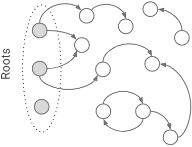
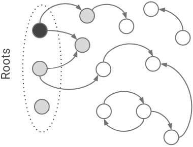
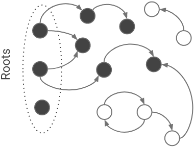

# 垃圾回收：基本概念

v8 是 node 的 vm。我们讨论 node 的垃圾回收，也就是讨论 v8 的垃圾回收。

v8 使用 c++进行开发，c++是一门需要手动进行垃圾回收的语言（当然它也有很多成熟的垃圾回收器）。下面我们先来了解一些 c++内存管理的简单知识。

## 分配

在 c++中，内存分区有：栈区（stack）、堆区（heap，也叫 free store）、全局区（static）、常量区、代码区。

### 栈区

栈区的内存由编译器自动分配和释放。函数的入参、以及在函数中的局部变量，都属存放在栈区。栈区是一个连续的内存空间。局部变量进入栈区和从栈区释放，符合 LIFO（后进先出）的顺序。

栈区的大小和操作系统有关，一般不会太大，一般从几 kb 到几 mb。

当栈区的内存不够的时候，会报栈溢出（stack overflow :) ）的错误。

### 堆区

堆区由用户通过`new`操作符分配，通过`delete`操作符释放。如果进程退出，堆区的数据占用的内存也会被操作系统释放。

堆区的内存分配是不连续的，可以动态扩展和收缩。所以随着一系列的内存的分配和释放，会使内存碎片化。

### 示例

可以看看下面这个简单的例子：

```c++
// 全局区
int a = 0；
// 常量区
const int B = 0;
int main() {
  // 栈区
  int c = 0;
  // 堆区，但是指向堆的指针 d 存放在栈区
  int *d = new int(0);
  return 0;
}
```

## mutator

mutator 这个词是由`Edsger Dijkstra` 提出来的。意思是改变某个事物。在 gc 中，mutator 改变的是对象的引用关系。

## 标记

由于在堆中的内存需要使用`delete`进行手动回收，所以就有了许多垃圾自动回收的解决方案。当然，在回收之前，我们需要识别哪些对象可以回收，哪些不能。

通常我们使用根搜索的算法来识别活跃的对象。

### 根搜索算法

在 v8 中，对象之间的引用关系会记录在一系列的 gc roots 节点上。垃圾回收器可以从这些固定的 gc roots 出发，遍历出所有的可达对象。这些可达对象，就是还处于存活状态的对象。我们可以将这种遍历，认为是一种图遍历。

这个阶段我们通常成为标记（mark）：


v8 在`src/roots/roots.h` 中定义了许多的 gc roots。

```c++
#define STRONG_READ_ONLY_ROOT_LIST(V)                                          \
  V(Map, free_space_map, FreeSpaceMap)                                         \
  // more ...
// more ...

```

### 三色标记法

在许多编程语言的垃圾回收器中，使用了三色标记法来标记对象。

三色标记法将对象分为三种颜色，代表三个状态：

-   白色：没有被标记过，会被回收
-   灰色：该对象被标记过，但和它有引用关系的对象还没标记完
-   黑色：该对象被标记过，是存活对象

标记的过程如下：

-   所有对象初始颜色均为白色
-   从根节点开始，当 gc 遍历到一个对象的时候，将其标记为灰色
-   当 gc 将这个对象的所有属性都遍历完的时候，将其标记为黑色
-   重复上面的步骤，当没有灰色对象的时候，标记结束







### 漏标和误标

在标记过程中，往往是标记线程和用户线程是并发执行的。如果在标记的时候，用户修改了对象的引用关系，标记线程把在用户线程应该回收的对象标记成了存活，产生了**浮动垃圾**，称为**漏标**。

漏标可以交给下次垃圾回收处理。

如果是并发执行情况下，标记线程把用户线程中应该存活的对象标记成了回收，会导致非常严重的错误，称为**误标**。

在三色算法中，产生上述情况可以总结为：

-   当用户线程在并发标记阶段，插入了一条黑色对象到白色对象的引用（某个黑色对象由能从root访问到了）
-   当用户线程在并发标记阶段，删除了某个灰色对象到白色对象的所有引用（某个灰色对象再也不能从root访问到了）

解决漏标和误标有两种办法：增量更新和原始快照，同时需要用到读写屏障的机制。

#### 读写屏障

当某个对象引用发生改变的时候，我们将这个改变记录下来（可以理解为另外一种AOP或者代理）。

#### 增量更新

从三色算法角度上看，屏障中保存的是白色对象对黑色对象的引用关系，当并发标记结束后，会将这个被引用的黑色对象（包括它的后代）重新插入对象树中，再进行一次标记。

增量更新同时处理了对象在并发标记阶段的“起死回生”与“突然死亡”的情况。

#### 原始快照

屏障记录下灰色对象的引用关系被删除的操作，当并发标记结束之后，gc从快照中重新对这个灰色对象进行标记。若存活则不会误标，若不存活，则称为浮动垃圾，在下一次gc中回收。

原始快照只处理了对象在并发标记阶段的“起死回生”的情况。

## 清除

在标记完成之后，我们对未被标记的对象进行回收，也称为清除（sweep）：


如果是用这种简单的清除方式，不可避免的会产生内存碎片化问题。在**垃圾回收：常见回收算法**这一章节中介绍了一些垃圾回收的方法，能够避免内存碎片化的问题。

## STW

在标记阶段，为了避免新的对象进入，主线程会被短暂的暂停，称为 STW(`stop the world`)。在这个阶段，是无法创建新的对象的。如果 stw 时间太长，就会造成卡顿。

gc 优化的主要目标之一，就是减少 stw 的时长。

## safe point

对 safe point 有如下定义：

> A point in program where the state of execution is known by the VM

即 vm 能够知道程序执行状态的某个时间点。同样的，在程序运行过程中，mutator 不再修改对象引用关系的那个时间点，这个时候程序的对象关系引用图是稳定的。程序运行到这个点，可以进入暂停（stw）状态。这个点称为 safe point。

## 对象生存期

堆中的大部分对象，都是朝生夕死，但是少部分则活的非常的长。

如下图：


这种现象被称为`weak generational hypothesis`。这个也很符合我们的直觉。为了适应这种情况，v8 采取了分代收集的策略。
