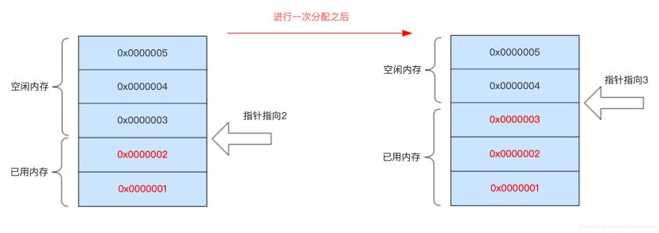
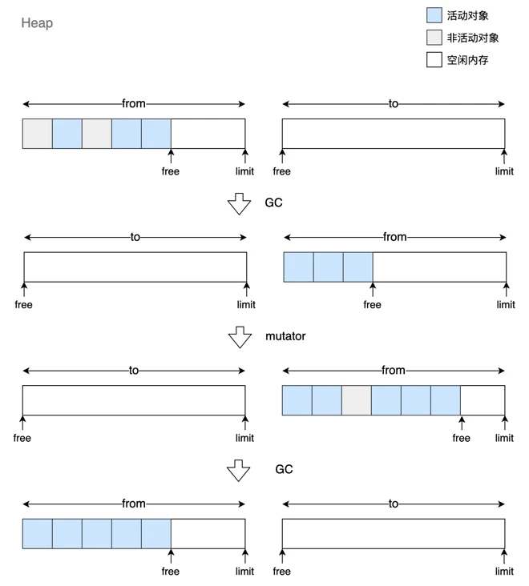
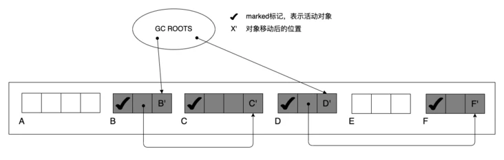
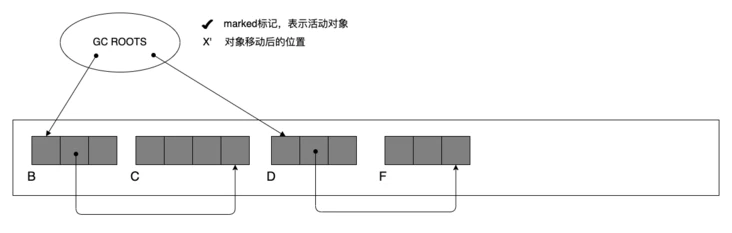

# 垃圾回收：常见回收算法

## 复制

复制算法是一种以空间换时间的算法。它在所有的垃圾回收算法里面效率最高。

通常，复制算法会将堆中的一块区域一分为二，一半是 from 区域，一半是 to 区域。

复制算法区域采用线性分配的方式。一般分配一个固定大小的区域（v8 & 64 位系统，这个区域大小为 16mb），然后在每分配一个新对象到 to 区域的时候，移动一次指针。这种方式成为`碰撞指针`。



新的对象会被分配到 from 区域。当 gc 开始的时候，mark 阶段通过我们之前讲的**根搜索算法**，将存活的对象标记出来。之后在 sweep 阶段，将 from 区域存活的对象拷贝到 to 区域。拷贝的过程中，to 区域的内存分配由于是线性分配，内存碎片自然就被消除了。当 gc 完成的时候，后面新产生的对象会分配在 to 区域，也就是说，这个时候的 to 区域，被当做 from 区域使用了。

通过额外的浪费一部分空间，复制算法避免了整理内存碎片的开销。

整体流程可以参考下图：



复制算法的优点有：

-   吞吐量高，只处理存活的对象，不用整理内存碎片
-   分配速度快，分配新对象的时候，只需要移动指针即可
-   没有内存碎片化问题

当然，也有很明显的缺点：

-   需要耗费双倍的内存空间
-   复制大对象的开销比较大

## 标记-清除

标记-清除（mark-sweep）算法，会使用空闲链表（free-list）的策略进行内存分配。以一个简单的 free-list 策略为例，其维护一个链表：

```c++
struct ListNode {
  int size; // 大小
  bool used; // 是否被使用
  Object *object; // 数据
  ListNode *next;
}

```

当新对象需要分配的时候，只要在链表中搜索出空闲的节点即可。如果内存不足，则调用 gc，开始遍历 free-list，标记并清除 free-list 中失效的对象。

### 分配策略

在内存分配的时候，我们需要找到那个合适的节点，这个节点的 size 大小要满足新对象的大小。有以下几种策略：

-   first fit
    -   从链表头部开始扫描，直到找到第一个 size 能够容纳得下新对象的节点
    -   相对快，但控制内存碎片上不是最优
-   best fit
    -   遍历整个链表，找到 size 最接近新对象的节点
-   worst fit
    -   遍历整个链表，如果找不到 size 等于新对象大小的节点，就从 size 最大的那个 node 中分配

### bitmap

在标记阶段，需要使用指针和标志位来记录信息，这会占用一定的内存空间，我们可以使用 bitmap 来优化这一点。

bitmap 是一种高效的标记方式。我们可以在一块连续的内存中，将其划分成每 n byte（可以是 32、64、128 等）一块区域。我们使用位图来表示这块区域是否正在使用：

```text
// 位图
[00000001]
// 每一位都表示内存中一块区域是否正在使用
[   0      0        0       0       0       0       0       1  ]
[64byte][64byte][64byte][64byte][64byte][64byte][64byte][64byte] // 连续的内存区域

```

在 sweep 阶段，如果要回收内存，只需要对位图进行修改即可。

使用 bitmap 的好处是：

-   压缩存储空间
-   运算效率高（位操作）
-   兼容操作系统的 cow（copy on write）

### 多空闲列表

在分配策略上我们也可以做一些优化。可以建立多个 free-list，分别用于分配 1byte、2byte、3byte...等的新对象，超过一定体积的新对象都分配在一个大对象 free-list 中。这样可以在一定的程度上消除碎片化问题，减少每次分配上的线性搜索时间。

## 标记-整理

标记整理(mark-compact)算法在标记阶段，和标记清除算法是一致的。在压缩阶段会对内存中存活的对象和碎片进行扫描，最后将存活的对象统一移动到内存的一端。如下图：





### 空间压缩

压缩后的对象排序有以下几种：

-   任意顺序
    -   将存活对象放在一起，但是不考虑存活对象之间的引用顺序，不存在内存碎片
    -   任意顺序实现起来简单，速度快，但可能将有相关性的对象分配到不同的虚拟内存页或者缓存行，可能影响到 app 的性能
-   线性顺序
    -   将被引用的存活对象连续放在一起，不考虑内存碎片
-   滑动顺序
    -   将存活的对象放在一起并且将被引用的对象连续在一起，不存在内存碎片

#### 双指针法

使用两个指针，left 和 right，left 从前向后，right 从后向前扫描。双指针法会进行两次扫描。

第一轮扫描主要是：当 left 遇到空闲的内存块停止下来；right 遇到存活对象停止下来。然后将 right 指向的对象复制到 left 指向的空闲内存块中。同时记录下这个转发的关系。最终当 left ≥ right 的时候停止本轮扫描。

第二轮扫描则是根据上一轮的转发关系，将对象的引用关系修改到转发以后的地址上。

双指针法处理之后的对象排序是**任意顺序**。

当然，还有其它的算法，如`Lips2` 、`Threaded Compaction`等，实现较为复杂。

## 优化

我们可以在许多方面对 gc 的过程进行优化。主要有以下几种方式：

-   分代回收
-   并发标记
-   增量标记
-   延迟回收

### 分代回收

前文我们提到过**对象生存期**这个现象，在对象创建初期，它的存活概率是很低，复制算法具有很高的吞吐量，并且不不会产生内存碎片，非常适合于这种场景。而少部分对象则会长期存活，不需要额外内存空间的标记-清除、标记-整理算法则更合适于这个场景。

现代的垃圾回收器一般会采用分代回收的策略。刚创建的对象先被分配在使用复制算法的新生代空间（young space），当这些对象经历过两次回收仍然存活，则会被晋升（转移）到使用标记-整理、标记-清除的老生代空间（old space）中。另外，一些大的对象，会被直接晋升到老生代。

在分代回收的过程中，会产生跨代引用的问题。比如，老生代对象引用了某个新生代对象，但是这个新生代对象没有被其它新生代对象引用。

通常，跨代引用的出现次数是比较少的。我们不必对老生代进行全量遍历，只需要维护一个跨代引用的记忆集。只需要在 gc 的时候，对这个记忆集进行遍历即可。

### 并发标记

在标记阶段，为了能够准确的识别出需要回收的对象，会产生 STW。为了尽可能缩短这段时间，我们可以使用多个标记线程进行标记的手段，减少对主线程的阻塞。

以最常见的三色标记法为例 以最常见的三色标记法为例 **（下面内容可参考上文：垃圾回收:基本概念）（下面内容可参考上文：垃圾回收:基本概念）**，使用三色标记法进行多线程标记会产生几个问题：，使用三色标记法进行多线程标记会产生几个问题：

-   标记过程中，主线程重解除了对黑色对象的引用
-   标记过程中，主线程重新引用了白色对象

第一种我们称之为**浮动垃圾**，浮动垃圾对 gc 影响不大，通常交给下一次 gc 即可。第二种称为**对象漏标**，gc 会回收应该存活的对象。这个影响就非常大了。

为了解决上述问题，可以引入屏障（barrier）机制。

在不同的垃圾回收器中，对这种屏障有不同的称呼，但总的思路都是，在并发标记过程中，如果对象引用产生变动，将这个对象的变动及引用关系记录下来。然后会在并发标记结束之后，主线程会进行 stw，gc 会对变动的对象进行二次标记。

### 增量标记

一次 full gc 的时间，有可能长达几百毫秒，这会让程序处于长时间的无响应阶段。一个比较不错的优化手段是将标记的工作分为小块来做，一次一点，直到完成所有的任务。


这样会让程序处于一个随时可响应的状态。

从本质上来说，引用计数式的标记就是一种增量标记，但是由于它的缺陷与效率问题，一般不会采用。类似于并发标记，增量标记也有这个问题：在 gc 已经遍历过、或正在遍历某个对象的时候，这个对象的引用关系很可能被再次修改。

所以在增量标记的过程中，也引入了屏障机制。所以说，增量标记并没有缩短整体的 gc 时间，甚至略微增加了一些工作量，但这些代价都是值得的，它显著减少了 stw 的最大时长。

### 延迟清除

在标记完成之后，gc 可以根据具体情况按需清理。可以从最需要的页面开始，而不是全量清理，将清理的工作量平摊到空闲的时段。
