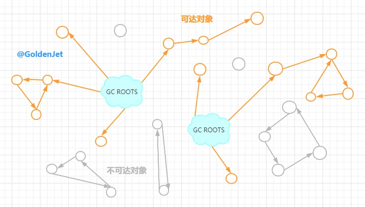

# 垃圾回收(v8, c++)

在node运行的时候，会不断的产生许多js对象。这些js对象会占用操作系统的内存空间。如果不对这些对象进行有效管理，那么内存占用会越来越高，甚至产生内存溢出。而v8是node的运行环境，这些js对象的管理和回收在v8中进行。node的垃圾回收，也就是v8的垃圾回收。

## c++内存分配

在c++中，内存分配（即变量存储）有三种方式：静态存储、自动存储、动态存储。

### 静态储存

在函数外面定义、或者用`static`修饰的变量，称为全局变量，存储在静态区，程序开始的时候分配内存，程序执行完毕才释放。

### 自动存储

在函数内部定义的常规变量（`auto`或者隐式的`auto`）储存在栈区。在函数执行的时候，这些变量被依次的压入栈中；函数执行完毕的时候，又依次出栈。整个栈区的内存分配是连续的，也不会产生内存碎片。

### 动态存储

c++中使用`new`在堆（`heap`，也称为`free store`）中分配内存。使用`delete`来释放堆中的内存。堆中的内存分配不一定是连续的，随着数据写入和释放，会产生内存碎片。

## v8中的堆内存分配

### 分配的类型

在v8的`global.h`中定义了`AllocationSpace`枚举类型，该类型将由v8进行gc的内存进行了划分：

```C++
enum AllocationSpace {
  // 只读空间，全局变量
  RO_SPACE,       // Immortal, immovable and immutable objects,
  // "老生代"
  OLD_SPACE,      // Old generation regular object space.
  CODE_SPACE,     // Old generation code object space, marked executable.
  MAP_SPACE,      // Old generation map object space, non-movable.
  // 大对象储存空间
  LO_SPACE,       // Old generation large object space.
  CODE_LO_SPACE,  // Old generation large code object space.
  // "新生代"
  NEW_LO_SPACE,   // Young generation large object space.
  NEW_SPACE,  // Young generation semispaces for regular objects collected with
              // Scavenger.

  FIRST_SPACE = RO_SPACE,
  LAST_SPACE = NEW_SPACE,
  FIRST_MUTABLE_SPACE = OLD_SPACE,
  LAST_MUTABLE_SPACE = NEW_SPACE,
  FIRST_GROWABLE_PAGED_SPACE = OLD_SPACE,
  LAST_GROWABLE_PAGED_SPACE = MAP_SPACE
};

```


v8主要划分出两块空间：`OLD_SPACE`：老生代、`NEW_SPACE`：新生代。（`RO_SPACE`、`CODE_SPACE`、`LO_SPACE`、`MAP_SPACE`都归属于老生代）。

这些内存空间，都是由v8自动分配、释放的。

### v8的堆外内存

堆外内存由用户通过v8进行分配、维护。比如node中的`buffer`就是分配在堆外内存中。堆外内存，本质上还是维护在堆中。区别只是谁来维护。

## 识别堆中需要回收的内存

要进行内存回收（gc），就必须先识别需要回收的内存。判定堆中的内存是否是需要回收，有两种常见的算法：引用计数算法和根搜索算法。

#### 引用计数

什么是引用计数算法？

> 当创建一个对象的实例并在堆上申请内存时，对象的引用计数就为1，在其他对象中需要持有这个对象时，就需要把该对象的引用计数加1，需要释放一个对象时，就将该对象的引用计数减1，直至对象的引用计数为0，对象的内存会被立刻释放。


引用计数算法的优势很明显，这种以空间换时间的办法，能够快速的识别需要回收的对象，而不会导致程序的长时间停止。同样，劣势也很明显，无法解决循环引用的问题。

#### 根搜索

根搜索算法，则是以某个根对象开始，遍历这个根对象的所有具有引用关系的对象图。如果不在这个图上的对象，则表示这个对象需要被回收。这个算法很好的解决了循环引用的问题。



v8中使用了根搜索算法识别需要回收的对象。

在进行根搜索的时候，会暂停js线程，我们称之为stw（stop the world）。

## 回收堆中的内存

我们通过部分源码，来看看v8的垃圾回收主要过程。

### CollectGarbaage()

在`heap.cc`中定义了`CollectGarbaage()`方法来进行垃圾回收。我们来看看这个方法的定义：

```C++
bool Heap::CollectGarbage(AllocationSpace space,
                          GarbageCollectionReason gc_reason,
                          const v8::GCCallbackFlags gc_callback_flags) {
  // ...
}
```


`CollectGarbage()`方法接收三个参数，分别是`space` 、`gc_reason` 和`gc_callback_flags`。`space`即上面介绍过的`global.h`中的`AllocationSpace`。

gc的时候，会先根据不同的space类型，采取不同的gc方法：

```C++
bool Heap::CollectGarbage(AllocationSpace space,
                          GarbageCollectionReason gc_reason,
                          const v8::GCCallbackFlags gc_callback_flags) {
  
  const char* collector_reason = nullptr;
  // 根据不同的空间类型
  // 采用不同的回收策略
  GarbageCollector collector = SelectGarbageCollector(space, &collector_reason);
  is_current_gc_forced_ = gc_callback_flags & v8::kGCCallbackFlagForced ||
                          current_gc_flags_ & kForcedGC ||
                          force_gc_on_next_allocation_;
  
  size_t freed_global_handles = 0;
  
  if (V8_ENABLE_THIRD_PARTY_HEAP_BOOL) {
    tp_heap_->CollectGarbage();
  } else {
    // gc
    freed_global_handles +=
        PerformGarbageCollection(collector, gc_callback_flags);
  }

  return freed_global_handles > 0;
}

```


当空间类型为old的时候，采取的是标记清除，young类型则采取scavenger策略。

```C++
GarbageCollector Heap::SelectGarbageCollector(AllocationSpace space,
                                              const char** reason) {
  // 当空间类型为old的时候 采取标记清除
  if (space != NEW_SPACE && space != NEW_LO_SPACE) {
    isolate_->counters()->gc_compactor_caused_by_request()->Increment();
    *reason = "GC in old space requested";
    return MARK_COMPACTOR;
  }

  // 其它case...
  
  *reason = nullptr;
  // 否则采取 SCAVENGER
  return YoungGenerationCollector();
}

  static inline GarbageCollector YoungGenerationCollector() {
#if ENABLE_MINOR_MC
    return (FLAG_minor_mc) ? MINOR_MARK_COMPACTOR : SCAVENGER;
#else
    return SCAVENGER;
#endif  // ENABLE_MINOR_MC
  }

```


在`PerformGarbageCollection()` 方法中，根据collector调用具体的策略：

```C++
size_t Heap::PerformGarbageCollection(
    GarbageCollector collector, const v8::GCCallbackFlags gc_callback_flags) {
  // ...
  
  switch (collector) {
    case MARK_COMPACTOR:
      MarkCompact();
      break;
    case MINOR_MARK_COMPACTOR:
      MinorMarkCompact();
      break;
    case SCAVENGER:
      Scavenge();
      break;
  }
  
  // ...
}
```


### Scavenge过程

scanenge（复制算法）用于回收new space中的内存。我们看看new space的结构：

#### new space结构

在`new_space.cc`中定义了初始化方法：

```C++
NewSpace::NewSpace(Heap* heap, v8::PageAllocator* page_allocator,
                   size_t initial_semispace_capacity,
                   size_t max_semispace_capacity)
    : SpaceWithLinearArea(heap, NEW_SPACE, new NoFreeList()),
      to_space_(heap, kToSpace),
      from_space_(heap, kFromSpace) {

  // 初始化 to space
  to_space_.SetUp(initial_semispace_capacity, max_semispace_capacity);
  // 初始化 from space
  from_space_.SetUp(initial_semispace_capacity, max_semispace_capacity);
  
}

```


new space中初始化了两块区域：to space和from space。

#### 整体流程

`heap.cc`中定义了scavenge策略：

```C++
void Heap::Scavenge() {
  // 开始在新生代中进行gc
  tracer()->NotifyYoungGenerationHandling(
      YoungGenerationHandling::kRegularScavenge);

  TRACE_GC(tracer(), GCTracer::Scope::SCAVENGER_SCAVENGE);
  // 加锁
  base::MutexGuard guard(relocation_mutex());
  
  // 最终调用到 job_handle_->Cancel()
  // 这部分代码会触发stop the world，scop和内存分配器不可用，工作线程被挂起
  ConcurrentMarking::PauseScope pause_scope(concurrent_marking());
  AlwaysAllocateScope scope(this);
  PauseAllocationObserversScope pause_observers(this);
  IncrementalMarking::PauseBlackAllocationScope pause_black_allocation(
      incremental_marking());

  
  mark_compact_collector()->sweeper()->EnsureIterabilityCompleted();
  // 设置gc的状态为SCAVENGE
  SetGCState(SCAVENGE);

  // 对新生代空间进行翻转
  new_space()->Flip();
  // 清除失活对象
  new_space()->ResetLinearAllocationArea();

  // 同样，对大对象空间进行翻转  
  new_lo_space()->Flip();
  new_lo_space()->ResetPendingObject();

  LOG(isolate_, ResourceEvent("scavenge", "begin"));
  // 进行垃圾回收，将to space中的存活对象晋升到old space中
  scavenger_collector_->CollectGarbage();

  LOG(isolate_, ResourceEvent("scavenge", "end"));

  SetGCState(NOT_IN_GC);
}
```


#### 1. 拷贝from space中的所有对象到to space

`new_lo_space()->Flip()`会将from space中的所有对象及其标记信息拷贝到to space中：

```C++
void SemiSpace::Swap(SemiSpace* from, SemiSpace* to) {

  std::swap(from->target_capacity_, to->target_capacity_);
  std::swap(from->maximum_capacity_, to->maximum_capacity_);
  std::swap(from->minimum_capacity_, to->minimum_capacity_);
  std::swap(from->age_mark_, to->age_mark_);
  std::swap(from->memory_chunk_list_, to->memory_chunk_list_);
  std::swap(from->current_page_, to->current_page_);
  std::swap(from->external_backing_store_bytes_,
            to->external_backing_store_bytes_);

}
```


#### 2. 清除to space中的失活对象

`new_space()->ResetLinearAllocationArea()` 逻辑如下：

```C++
void NewSpace::ResetLinearAllocationArea() {
  // 获取对象标记
  IncrementalMarking::NonAtomicMarkingState* marking_state =
      heap()->incremental_marking()->non_atomic_marking_state();
  for (Page* p : to_space_) {
    // 清除失活的对象
    marking_state->ClearLiveness(p);
  }
}
```


#### 3. 存活对象晋升到old space


### MarkCompact过程

### 分代收集策略

从v8的堆内存划分以及回收的策略来看，v8采用了分代收集的策略。为什么会采用此策略呢？


