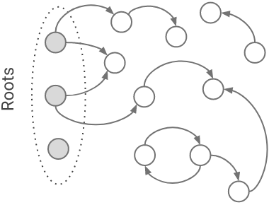
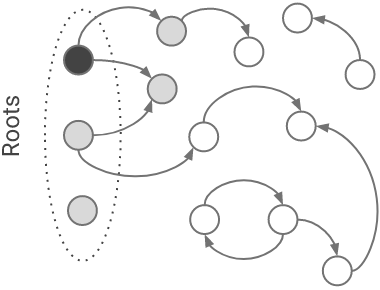
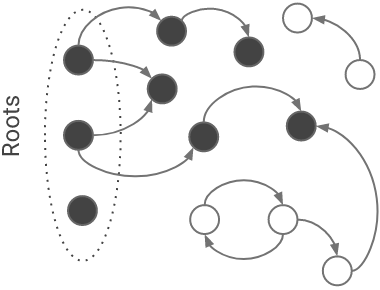
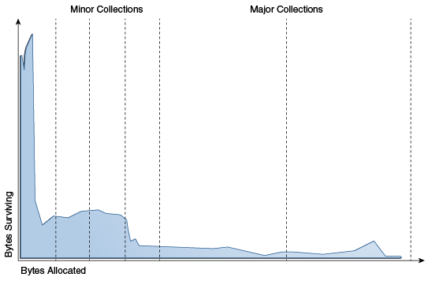

# 垃圾回收：基本概念

v8是node的vm。我们讨论node的垃圾回收，也就是讨论v8的垃圾回收。

v8使用c++进行开发，c++是一门需要手动进行垃圾回收的语言（当然它也有很多成熟的垃圾回收器）。下面我们先来了解一些c++内存管理的简单知识。

## 分配

在c++中，内存分区有：栈区（stack）、堆区（heap，也叫free store）、全局区（static）、常量区、代码区。

### 栈区

栈区的内存由编译器自动分配和释放。函数的入参、以及在函数中的局部变量，都属存放在栈区。栈区是一个连续的内存空间。局部变量进入栈区和从栈区释放，符合LIFO（后进先出）的顺序。

栈区的大小和操作系统有关，一般不会太大，一般从几kb到几mb。

当栈区的内存不够的时候，会报栈溢出（stack overflow :) ）的错误。

### 堆区

堆区由用户通过`new`操作符分配，通过`delete`操作符释放。如果进程退出，堆区的数据占用的内存也会被操作系统释放。

堆区的内存分配是不连续的，可以动态扩展和收缩。所以随着一系列的内存的分配和释放，会使内存碎片化。

### 示例

可以看看下面这个简单的例子：

```C++
// 全局区
int a = 0；
// 常量区
const int B = 0;
int main() {
  // 栈区
  int c = 0;
  // 堆区，但是指向堆的指针 d 存放在栈区
  int *d = new int(0);
  return 0;
}
```


## mutator

mutator这个词是由`Edsger Dijkstra` 提出来的。意思是改变某个事物。在gc中，mutator改变的是对象的引用关系。

## 标记

由于在堆中的内存需要使用`delete`进行手动回收，所以就有了许多垃圾自动回收的解决方案。当然，在回收之前，我们需要识别哪些对象可以回收，哪些不能。

通常我们使用根搜索的算法来识别活跃的对象。

### 根搜索算法

在v8中，对象之间的引用关系会记录在一系列的gc roots节点上。垃圾回收器可以从这些固定的gc roots出发，遍历出所有的可达对象。这些可达对象，就是还处于存活状态的对象。我们可以将这种遍历，认为是一种图遍历。

这个阶段我们通常成为标记（mark）：


v8在`src/roots/roots.h` 中定义了许多的gc roots。

```C++
#define STRONG_READ_ONLY_ROOT_LIST(V)                                          \
  V(Map, free_space_map, FreeSpaceMap)                                         \
  // more ...                   
// more ...                   

```


### 三色标记法

在许多编程语言的垃圾回收器中，使用了三色标记法来标记对象。

三色标记法将对象分为三种颜色，代表三个状态：

- 白色：没有被标记过，会被回收
- 灰色：该对象被标记过，但和它有引用关系的对象还没标记完
- 黑色：该对象被标记过，是存活对象

标记的过程如下：

- 所有对象初始颜色均为白色
- 从根节点开始，当gc遍历到一个对象的时候，将其标记为灰色
- 当gc将这个对象的所有属性都遍历完的时候，将其标记为黑色
- 重复上面的步骤，当没有灰色对象的时候，标记结束







## 清除

在标记完成之后，我们对未被标记的对象进行回收，也称为清除（sweep）：


如果是用这种简单的清除方式，不可避免的会产生内存碎片化问题。在[垃圾回收：常见回收算法](https://www.wolai.com/5RbxeUyqrrLx53czyBukQT)这一章节中介绍了一些垃圾回收的方法，能够避免内存碎片化的问题。

## STW

在标记阶段，为了避免新的对象进入，主线程会被短暂的暂停，称为STW(`stop the world`)。在这个阶段，是无法创建新的对象的。如果stw时间太长，就会造成卡顿。

gc优化的主要目标之一，就是减少stw的时长。

## safe point

对safe point有如下定义：

> A point in program where the state of execution is known by the VM


即vm能够知道程序执行状态的某个时间点。同样的，在程序运行过程中，mutator不再修改对象引用关系的那个时间点，这个时候程序的对象关系引用图是稳定的。程序运行到这个点，可以进入暂停（stw）状态。这个点称为safe point。

## 对象生存期

堆中的大部分对象，都是朝生夕死，但是少部分则活的非常的长。

如下图：



这种现象被称为`weak generational hypothesis`。这个也很符合我们的直觉。为了适应这种情况，v8采取了分代收集的策略。

