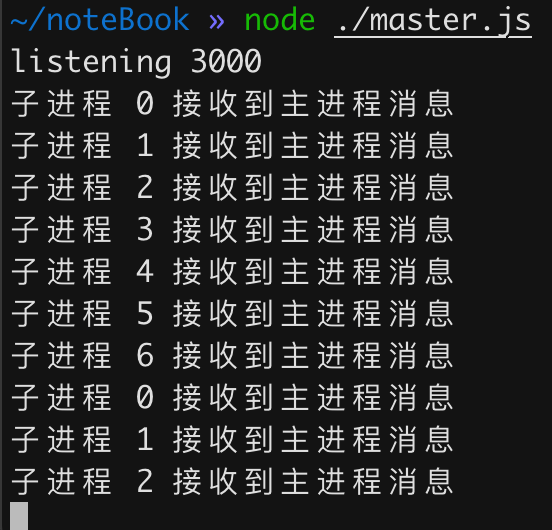

# cluster的负载均衡

## 实现负载均衡

以轮询的方式实现，在主进程中，我们创建数个子进程，并起一个IPC服务，用于负载均衡。

```javascript
// master.js
const childProcess = require("child_process");
const os = require("os");
const net = require("net");

const workers = [];
let index = 0;
let maxWorkerNum = os.cpus().length - 1;

for (let i = 0; i < maxWorkerNum; i++) {
  workers.push(childProcess.fork("./worker.js", { env: { index: i } }));
}

const server = net.createServer((socket) => {
  socket.on("data", (data) => {
    workers[index].send(data.toString());
    // 一个简单的循环发送机制
    index = ++index % maxWorkerNum;
    socket.end();
  });
});

server.listen(3000, (data) => {
  console.log("listening 3000");
});
```

在`worker.js`中监听消息：

```javascript
// worker.js
process.on("message", (message) => {
  console.log(`子进程 ${process.env.index} 接收到主进程消息`);
});
```

最终，我们可以看到，消息以rr的形式，在7个worker进程中分发：



## PM2

pm2是一个node开发中常用的集群管理工具。

主要功能是：

-   开启多进程
-   守护进程

### 开启多进程

采用`cluster`或者`child_process.fork()`来开启多个进程。

### 守护进程

原理是主进程监听子进程的退出事件，在handle中重启进程：

```javascript
const server = net.createServer((socket) => {
  socket.on("exit", (data) => {
    process.fork('app.js')
  });
});

```

### docker & pm2

一般遵循one process per container原则。如果说docker中进程挂了，交由docker重启即可。无需再引入pm2做进程管理。
